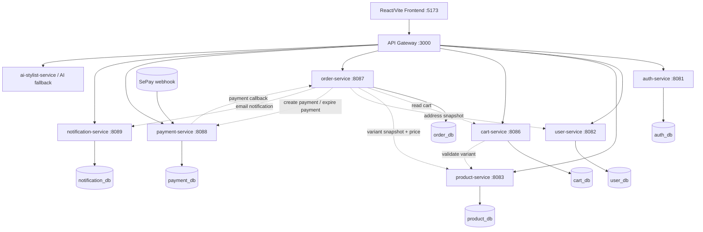
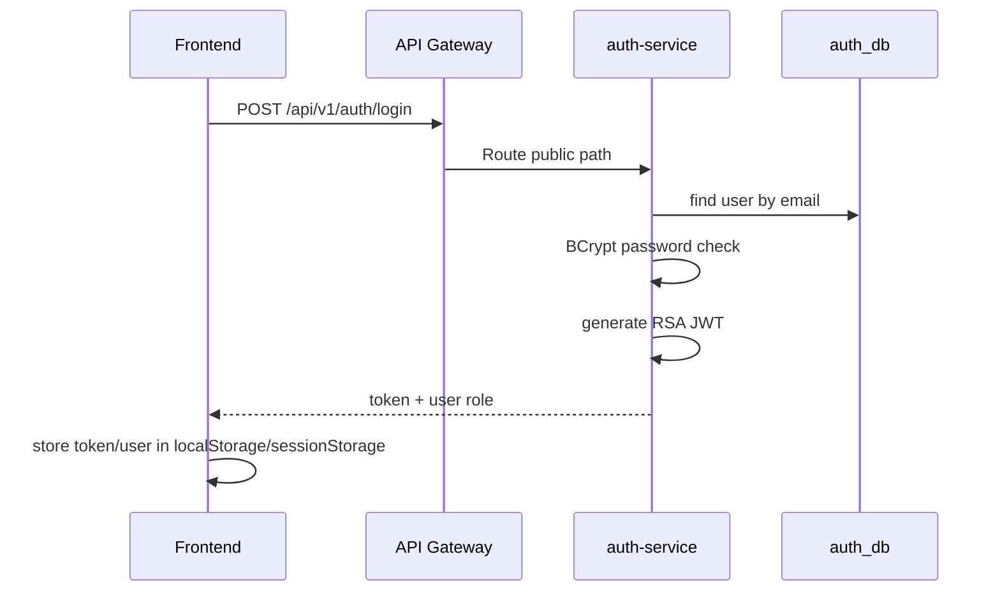
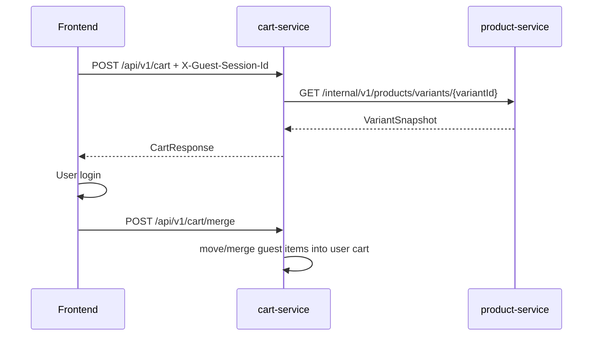
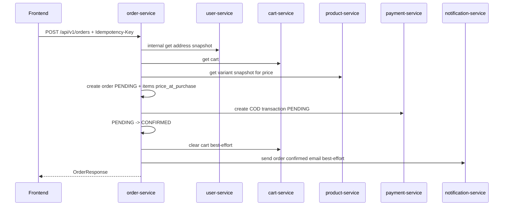
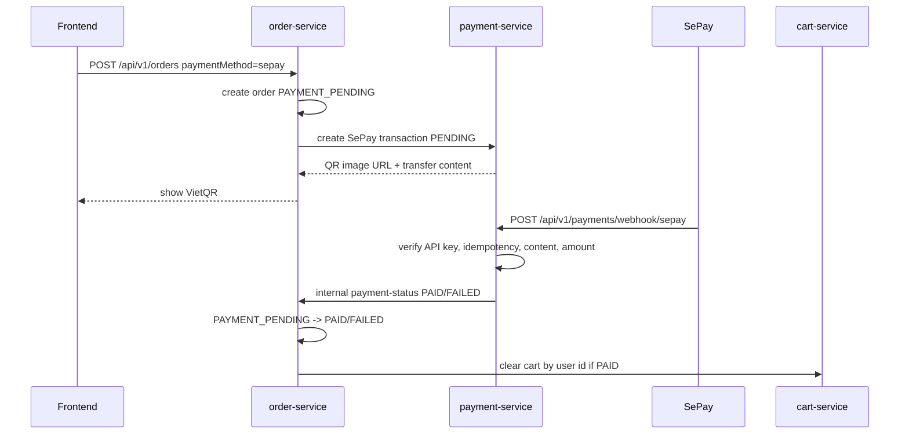
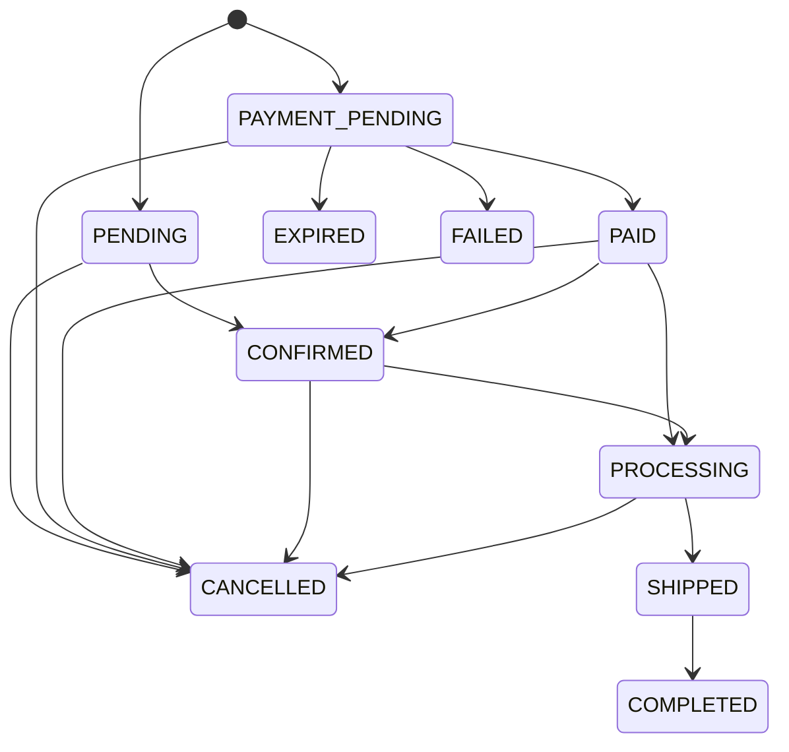
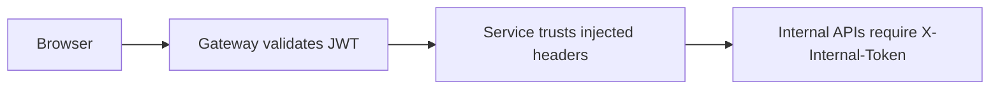

# StyleMind - Sổ Tay Hiểu Dự Án Và Trình Bày

> Mục tiêu của file này: giúp bạn nắm dự án theo cách có thể trình bày trước giáo viên: kiến trúc tổng thể, công nghệ, database, luồng nghiệp vụ, logic code quan trọng, cách demo, và các câu hỏi thường bị hỏi.

## 1. Tóm Tắt Dự Án Trong 60 Giây

StyleMind là một hệ thống thương mại điện tử thời trang có tích hợp AI Stylist. Người dùng có thể xem sản phẩm, lọc sản phẩm theo danh mục/giới tính/giá, quản lý giỏ hàng, lưu hồ sơ phong cách, chọn địa chỉ giao hàng, checkout bằng COD hoặc SePay VietQR, theo dõi đơn hàng và nhận thông báo. Admin có dashboard để quản lý sản phẩm, đơn hàng, người dùng, thông báo và các phần AI.

Điểm kỹ thuật chính của dự án là mô hình microservices:

- Frontend React/Vite chỉ gọi API Gateway.
- API Gateway route request tới các service Java Spring Boot.
- Mỗi service có database PostgreSQL riêng.
- Order Service đóng vai trò orchestrator cho checkout.
- Payment Service xử lý COD/SePay và webhook đối soát thanh toán.
- Common Lib gom logic dùng chung như response format, security filter, JWT utility, exception handler.

Câu trình bày gọn:

> "StyleMind được thiết kế theo microservices và database-per-service. Frontend không gọi trực tiếp từng service mà đi qua API Gateway. Gateway xác thực JWT rồi inject user context xuống các service. Luồng checkout được order-service điều phối theo saga vì không có transaction ACID xuyên nhiều database."

## 2. Sơ Đồ Kiến Trúc Tổng Thể



### Vì Sao Chọn Microservices?

Ưu điểm:

- Tách rõ nghiệp vụ: auth, user profile, product, cart, order, payment, notification.
- Mỗi service có database riêng nên giảm coupling dữ liệu.
- Dễ scale/deploy từng phần, ví dụ payment hoặc AI có thể nâng cấp riêng.
- Phù hợp để mô phỏng hệ thống thật.

Nhược điểm:

- Vận hành phức tạp hơn monolith: nhiều container, nhiều DB, nhiều port.
- Không có transaction ACID xuyên service, phải dùng saga/compensation.
- Debug cần log, correlation id, health check.

Câu trả lời nếu bị hỏi "dự án nhỏ sao dùng microservices?":

> "Với dự án nhỏ, modular monolith sẽ nhanh hơn. Nhưng nhóm chọn microservices để học cách tách bounded context, database-per-service, API gateway, JWT boundary và saga checkout như hệ thống thực tế."

## 3. Công Nghệ Sử Dụng

### Frontend

| Công nghệ | Vai trò |
|---|---|
| React 18 | Xây UI dạng SPA |
| Vite | Dev server và build frontend |
| React Router | Routing customer/admin/auth |
| Zustand | State management cho auth/cart |
| Axios | Gọi API gateway |
| Tailwind CSS | Styling |
| Lucide React | Icon |
| Recharts | Dashboard/chart |
| Playwright | E2E test |

Frontend đọc `VITE_API_BASE_URL` từ `FE/.env`, hiện trỏ tới `http://localhost:3000`.

### Backend

| Công nghệ | Vai trò |
|---|---|
| Java 17 | Runtime chính |
| Spring Boot 3.2.5 | Framework cho từng service |
| Spring Cloud Gateway | API Gateway |
| Spring Security | RBAC, filter, method security |
| Spring Data JPA/Hibernate | ORM |
| PostgreSQL | Database chính, mỗi service một DB |
| Flyway | Migration cho auth/user/product service |
| OpenFeign | Service-to-service HTTP call |
| Lombok | Giảm boilerplate |
| MapStruct | Mapping DTO/entity ở một số module |
| jjwt/RSA | JWT bất đối xứng |
| Redis | Rate limit ở gateway |
| MinIO/S3 + Cloudinary | Hạ tầng lưu ảnh sản phẩm |
| Neo4j/Qdrant | Hạ tầng cho AI knowledge/vector |
| Docker Compose | Chạy local stack |

## 4. Cấu Trúc Source Code

```text
MSS301-Stylemind/
  FE/                         Frontend React/Vite
    src/app/                  Router, protected route
    src/features/             API + store + mapper theo nghiệp vụ
    src/pages/                Customer/Admin/Auth pages
    src/components/           UI components

  BE/                         Backend multi-module Maven
    common-lib/               Security, ApiResponse, exception, JWT shared
    api-gateway/              Spring Cloud Gateway, routing, rate limit
    auth-service/             Login/register/reset/admin user
    user-service/             Style profile, delivery address
    product-service/          Catalog, category, variant, image
    cart-service/             Guest/auth cart, merge cart
    order-service/            Checkout orchestration, state machine
    payment-service/          COD, SePay QR, webhook reconciliation
    notification-service/     Email/log notification
    init-scripts/             Local PostgreSQL schema/seed
    docker-compose.yml        Local infra + services

  docs/architecture/          Tài liệu kiến trúc gốc
```

## 5. Các Service Và Trách Nhiệm

| Service | Port | Database | Trách nhiệm chính |
|---|---:|---|---|
| api-gateway | 3000 | Không có DB nghiệp vụ | Route API, validate JWT, inject `X-User-*`, rate limit, CORS |
| auth-service | 8081 | auth_db | Identity: email/password, role, account status, register OTP, reset password, admin account |
| user-service | 8082 | user_db | Basic profile, địa chỉ giao hàng, dữ liệu tỉnh/phường Việt Nam |
| product-service | 8083 | product_db | Category, product, variant/SKU, image, variant snapshot |
| cart-service | 8086 | cart_db | Giỏ hàng guest/user, add/update/remove/merge/clear |
| order-service | 8087 | order_db | Tạo đơn, saga checkout, trạng thái đơn hàng, admin order |
| payment-service | 8088 | payment_db | COD transaction, SePay VietQR, webhook idempotency, payment status |
| notification-service | 8089 | notification_db | Log thông báo, gửi email, retry notification |
| ai-stylist-service | image ngoài | ai_stylist + Neo4j/Qdrant | Chat AI, session/message, knowledge/vector pipeline |

Lưu ý local hiện tại: image `stylemind/ai-stylist-service:latest` bị pull denied nếu chạy `--profile all`. Khi demo phần Java chính, có thể chạy bỏ qua AI service.

## 6. Database Theo Service

Điểm quan trọng nhất: dự án dùng database-per-service, nghĩa là không có foreign key xuyên service. Ví dụ `orders.user_id` chỉ là ID tham chiếu logic tới `auth-service`, không FK qua `auth_db`.

### auth_db

| Bảng | Ý nghĩa |
|---|---|
| `users` | Identity account: email, password hash, provider, role, account status |
| `pending_registrations` | Đăng ký chờ xác thực OTP email |
| `audit_log` | Audit thao tác admin trên account |

Seed account:

| Email | Password | Role |
|---|---|---|
| `admin@stylemind.ai` | `Admin@123` | ADMIN |
| `customer@stylemind.ai` | `Customer@123` | CUSTOMER |

Logic đáng nói:

- Password hash bằng BCrypt.
- Register không tạo user ngay; lưu vào `pending_registrations`, gửi OTP, verify OTP mới promote thành user thật.
- Admin không được tự xóa/khóa/hạ quyền chính mình.
- Có guard chống xóa/hạ quyền admin active cuối cùng.

### user_db

| Bảng | Ý nghĩa |
|---|---|
| `user_profiles` | Basic profile 1:1 theo `user_id` (hiện giữ `display_name`) |
| `delivery_addresses` | Địa chỉ giao hàng của user |
| `administrative_provinces` | Tỉnh/thành Việt Nam |
| `administrative_wards` | Phường/xã Việt Nam |

Logic đáng nói:

- `user-service` không giữ password/role/login.
- Đọc danh sách địa chỉ không tạo profile shell; `user_profiles` chỉ giữ basic profile đã được xác nhận.
- Địa chỉ checkout phải `VALID`.
- Dữ liệu tỉnh/phường import từ file pinned `vietnam-admin-units-v4.0.0.json`.
- Số điện thoại được normalize bằng service riêng.

### product_db

| Bảng | Ý nghĩa |
|---|---|
| `categories` | Cây danh mục |
| `products` | Sản phẩm gốc |
| `product_categories` | Many-to-many product/category |
| `product_variants` | SKU/size/color/material/stock |
| `product_images` | Ảnh sản phẩm |
| `product_audit_log` | Audit xóa product/variant/image |

Seed hiện có:

- 50 products.
- 150 variants.
- 50 images.
- 200 product-category links.
- 26 categories.

Logic đáng nói:

- Public chỉ xem sản phẩm sellable/ACTIVE.
- Admin tạo product mặc định `INACTIVE`.
- Không được activate product nếu chưa có variant.
- Không được xóa variant cuối cùng của product ACTIVE.
- `getVariantSnapshot()` là API nội bộ cực quan trọng: trả product name, sku, size, color, material, effective price, stock, image. Cart/order dựa vào đây.

### cart_db

| Bảng | Ý nghĩa |
|---|---|
| `shopping_carts` | Một cart cho user hoặc guest |
| `cart_items` | Item trong cart, có variant_id, quantity, AI flags |

Logic đáng nói:

- Guest cart dùng `X-Guest-Session-Id`.
- Sau login frontend gọi merge guest cart vào user cart.
- Khi add item, cart-service gọi product-service để validate variant active và còn stock.
- Giá trong cart chỉ để hiển thị; checkout sẽ lấy giá authoritative lại từ product-service.

### order_db

| Bảng | Ý nghĩa |
|---|---|
| `orders` | Đơn hàng, total, status, shipping snapshot |
| `order_items` | Item snapshot: variant_id, quantity, price_at_purchase |
| `order_status_audit_log` | Lịch sử đổi trạng thái |
| `checkout_idempotency` | Chống double-click/double-submit checkout |

Logic đáng nói:

- Order lưu snapshot địa chỉ giao hàng để sau này địa chỉ user đổi thì đơn cũ không đổi.
- Order item lưu `price_at_purchase`, tức giá tại thời điểm mua.
- `checkout_idempotency` keyed theo `userId + Idempotency-Key`.

### payment_db

| Bảng | Ý nghĩa |
|---|---|
| `transactions` | Payment transaction theo order |
| `payment_webhook_events` | Audit mỗi webhook SePay |

Logic đáng nói:

- COD tạo transaction `PENDING`, order được confirm ngay.
- SePay tạo QR với transfer content chuẩn.
- Webhook phải có API key hợp lệ.
- Webhook idempotent theo `provider + gateway_transaction_id`.
- Match thanh toán phải đúng nội dung chuyển khoản và đúng số tiền.
- Late webhook sau khi expired/cancelled chỉ log, không revive order.

### notification_db

| Bảng | Ý nghĩa |
|---|---|
| `notification_logs` | Log email/notification: type, channel, status, error |

Logic đáng nói:

- Notification fail không rollback order/payment.
- Có retry cho notification `FAILED`.
- Nếu mail disabled hoặc không có mail sender thì có fallback log/skipped.

## 7. Luồng Nghiệp Vụ Quan Trọng

### 7.1 Login Và JWT



Các request sau login:

- Axios interceptor tự gắn `Authorization: Bearer <token>`.
- Gateway validate JWT.
- Gateway xóa header `X-User-*` do client tự gửi nếu có.
- Gateway inject `X-User-Id`, `X-User-Roles`, `X-User-Email`.
- Downstream service dùng `HeaderAuthenticationFilter` để tạo `UserPrincipal`.

### 7.2 Register Bằng OTP

Flow:

1. User nhập email/password.
2. `auth-service` kiểm tra email chưa tồn tại.
3. Hash password và OTP, lưu vào `pending_registrations`.
4. Gửi email OTP qua `notification-service`.
5. User nhập OTP.
6. Nếu OTP đúng và chưa hết hạn, tạo row trong `users`, xóa pending row.
7. User đăng nhập bình thường.

Điểm hay:

- Account thật chưa được tạo trước khi verify OTP.
- OTP/hash/reset token không lưu dạng plain text.
- Email OTP content log được redact `[PROTECTED]`.

### 7.3 Xem Product Catalog

Flow:

1. Frontend gọi `GET /api/v1/products`.
2. Gateway route tới product-service.
3. product-service search/filter theo category, search, targetDemographic, min/max price.
4. Response có product, categories, images, variants.

Admin product:

- Admin gọi `/api/v1/admin/products`.
- Có `@PreAuthorize("hasRole('ADMIN')")`.
- Admin quản lý product, variant, image, status.

### 7.4 Guest Cart, User Cart Và Merge Cart



Điểm cần nhấn:

- Cart có thể tồn tại khi chưa đăng nhập.
- Sau login, guest cart được merge vào user cart.
- Cart validate variant khi add item.
- Checkout vẫn fetch lại giá từ product-service nên không tin giá frontend/cart.

### 7.5 Checkout COD



Điểm trình bày:

- COD không cần webhook.
- Order được confirm ngay sau khi transaction COD được tạo.
- Payment COD vẫn `PENDING` vì tiền thu khi giao hàng.
- Clear cart/notification là best-effort: fail không rollback order.

### 7.6 Checkout SePay VietQR



Điểm trình bày:

- Frontend không tự xác nhận thanh toán.
- SePay webhook là nguồn xác nhận thanh toán.
- Payment match phải đúng reference và đúng amount.
- Webhook duplicate không xử lý lại.
- Order timeout job sẽ expire đơn `PAYMENT_PENDING` quá hạn.

### 7.7 Order State Machine



Các trạng thái terminal:

- `COMPLETED`
- `CANCELLED`
- `EXPIRED`
- `FAILED`

Code enforce:

- `OrderStatus.allowedTransitions()` định nghĩa transition hợp lệ.
- `OrderStatusService.changeStatus()` là cửa duy nhất đổi trạng thái.
- Mỗi lần đổi trạng thái đều ghi `order_status_audit_log`.

Câu nói hay:

> "Em không cho admin set status tùy ý. Mọi transition phải đi qua state machine, nếu sai thì trả 409 Conflict."

### 7.8 Admin Dashboard

Admin có thể:

- Xem tổng quan users/products/orders/notifications.
- Quản lý product/category/variant/image.
- Quản lý order và đổi trạng thái hợp lệ.
- Quản lý user: create, change role, enable/disable, delete.
- Retry notification failed.

RBAC:

- Frontend route admin được `RequireAdmin` guard.
- Backend controller admin có `@PreAuthorize("hasRole('ADMIN')")`.
- Gateway inject role từ JWT, client không tự giả role được.

## 8. API Convention Và Response Format

Prefix:

| Loại API | Prefix |
|---|---|
| Public/customer | `/api/v1/...` |
| Admin | `/api/v1/admin/...` |
| Internal service-to-service | `/internal/v1/...` |

Response chuẩn:

```json
{
  "success": true,
  "message": "Thao tác thành công",
  "data": {},
  "timestamp": "..."
}
```

Error chuẩn:

```json
{
  "success": false,
  "message": "Email hoặc mật khẩu không đúng",
  "errorCode": "AUTH_INVALID_CREDENTIALS",
  "timestamp": "..."
}
```

Frontend Axios interceptor:

- Nếu response có `success=false` thì throw normalized error.
- Nếu HTTP 401 thì clear session và redirect `/login`.
- Nếu success thì unwrap `body.data`.

## 9. Frontend Logic Quan Trọng

### Routing

Các nhóm route:

- Auth: `/login`, `/register`, `/forgot-password`, `/reset-password`.
- Customer: `/`, `/shop`, `/products/:id`, `/ai-stylist`, `/cart`, `/checkout`, `/orders`, `/notifications`.
- Admin: `/admin`, `/admin/products`, `/admin/orders`, `/admin/users`, `/admin/notifications`, ...

Guard:

- `RequireAuth`: chưa login thì về `/login`.
- `RequireAdmin`: chưa login thì về `/login`, non-admin thì về `/`.

### Auth Store

Zustand auth store giữ:

- `user`
- `token`
- `isAuthenticated`
- `role`

Khi login:

- Lưu token/user.
- Normalize role về lowercase.
- Merge guest cart vào user cart.

Khi logout:

- Clear token/user.
- Reset guest session id.
- Reset local cart.

### Checkout Frontend

Frontend tạo `Idempotency-Key` bằng `crypto.randomUUID()` hoặc fallback. Khi gọi:

```js
createOrder(payload, { idempotencyKey })
```

Header gửi:

```http
Idempotency-Key: <uuid>
```

Lý do:

- Nếu user double click checkout hoặc reload gửi lại request, backend không tạo 2 order/payment.

## 10. Security - Phần Nên Trình Bày Chắc

### Trust Boundary



Các lớp bảo vệ:

1. Gateway xóa `X-User-Id`, `X-User-Roles`, `X-User-Email` nếu browser tự gửi.
2. Gateway validate JWT bằng RSA public key.
3. Gateway inject user context sau khi token hợp lệ.
4. Service dùng `HeaderAuthenticationFilter` để tạo principal.
5. Internal endpoint `/internal/v1/**` yêu cầu `X-Internal-Token`.
6. Admin endpoint dùng `@PreAuthorize("hasRole('ADMIN')")`.
7. Password/OTP/reset token đều hash.
8. SePay webhook verify API key bằng constant-time comparison.
9. Gateway rate limit login, forgot password, AI chat bằng Redis.

## 11. AI Stylist Trong Kiến Trúc

Mục tiêu AI Stylist:

- Chat tư vấn outfit.
- Quản lý session/message.
- Dùng Neo4j cho knowledge graph.
- Dùng Qdrant cho vector search.
- Product service là nguồn catalog để AI recommend sản phẩm.

Trong code hiện tại:

- Frontend gọi `/api/v1/ai-stylist/sessions/**`.
- Gateway rewrite path tới AI service.
- Gateway có một `AiFallbackController` cho một số endpoint cũ/mock.
- Docker compose cấu hình image `stylemind/ai-stylist-service:latest`, nhưng image này có thể private nên local có thể bị pull denied.

Khi demo mà AI service chưa chạy:

> "Phần AI được thiết kế sẵn trong kiến trúc, có hạ tầng Neo4j/Qdrant và gateway route. Trong môi trường local hiện tại image AI service không public, nên nhóm demo các service Java core trước."

## 12. Cách Chạy Demo Local

Grafana đã chuyển sang port 3500, nên port 3000 dành cho API Gateway.

Chạy frontend:

```powershell
cd C:\Users\USER\OneDrive\Documents\GitHub\MSS301-Stylemind\FE
npm run dev
```

Chạy backend Java core, bỏ qua AI image private:

```powershell
cd C:\Users\USER\OneDrive\Documents\GitHub\MSS301-Stylemind\BE
docker compose up -d --no-build api-gateway auth-service user-service product-service cart-service order-service payment-service notification-service
```

Check gateway:

```powershell
Invoke-RestMethod http://localhost:3000/actuator/health
```

Check Grafana:

```powershell
Invoke-RestMethod http://localhost:3500/api/health
```

Tài khoản demo:

- Admin: `admin@stylemind.ai` / `Admin@123`
- Customer: `customer@stylemind.ai` / `Customer@123`

Lưu ý:

- Không dùng `docker compose --profile all up` nếu chưa có quyền pull image AI Stylist.
- Nếu login bị 401 ở `localhost:3000` hãy kiểm tra port 3000 có đúng là `stylemind-gateway` không.

## 13. Kịch Bản Trình Bày Gợi Ý

### Mở đầu

"Dự án của nhóm em là StyleMind, một hệ thống e-commerce thời trang có AI Stylist. Hệ thống cho phép khách hàng xem sản phẩm, quản lý giỏ hàng, checkout COD hoặc SePay VietQR, theo dõi đơn; admin quản lý sản phẩm, đơn hàng, user và notification."

### Kiến trúc

"Nhóm em chọn microservices. Frontend React gọi API Gateway, gateway route tới các Spring Boot service. Mỗi service sở hữu database riêng: auth_db, user_db, product_db, cart_db, order_db, payment_db, notification_db. Vì database tách riêng nên checkout không dùng transaction xuyên DB, mà order-service điều phối theo saga."

### Security

"Điểm bảo mật chính là trust boundary tại gateway. Browser không được gọi trực tiếp service hoặc internal endpoint. Gateway validate JWT, xóa header user giả, rồi inject user context xuống service. Các internal API dùng X-Internal-Token. Admin endpoint có RBAC bằng role ADMIN."

### Checkout

"Checkout là flow quan trọng nhất. Frontend chỉ gửi addressId, paymentMethod và Idempotency-Key. Order-service tự lấy cart, validate địa chỉ qua user-service, lấy giá authoritative qua product-service, tạo order và item với price_at_purchase. Nếu COD thì tạo transaction COD và confirm order ngay. Nếu SePay thì tạo QR, order giữ PAYMENT_PENDING, chờ webhook từ SePay đối soát đúng nội dung và số tiền mới chuyển PAID."

### Database

"Database được chia theo ownership. Auth giữ identity, user giữ profile/address, product giữ catalog/SKU/stock, cart giữ giỏ hàng, order giữ đơn và snapshot giá/địa chỉ, payment giữ transaction/webhook, notification giữ log email. Điều này tránh service khác truy cập trực tiếp dữ liệu không thuộc quyền sở hữu."

### Kết luận

"Điểm nhóm em học được là cách tách bounded context, dùng API Gateway làm boundary, dùng JWT/RBAC, xử lý checkout bằng saga và state machine, chống duplicate checkout bằng idempotency key, và đối soát webhook thanh toán an toàn."

## 14. Câu Hỏi Giáo Viên Có Thể Hỏi

### Vì sao không để frontend gửi giá sản phẩm khi checkout?

Vì frontend không đáng tin. User có thể sửa request. Order-service luôn gọi product-service lấy `VariantSnapshot` và `effectivePrice`, sau đó lưu vào `order_items.price_at_purchase`.

### Vì sao order lưu địa chỉ dạng snapshot?

Vì địa chỉ trong profile có thể thay đổi sau khi đặt hàng. Nếu order chỉ tham chiếu address live thì đơn cũ sẽ bị thay đổi lịch sử. Snapshot giúp đơn hàng giữ đúng thông tin tại thời điểm mua.

### Vì sao cần Idempotency-Key?

Để chống double submit. Nếu user double click checkout hoặc network retry, backend dùng `userId + idempotencyKey` để trả lại order cũ hoặc báo đang xử lý, không tạo payment/order trùng.

### Vì sao SePay webhook không cần JWT?

Webhook do server SePay gọi, không phải user browser. Vì vậy nó public ở gateway nhưng payment-service tự verify bằng API key riêng và log idempotency.

### Nếu notification gửi email fail thì order có rollback không?

Không. Notification là side effect. Order/payment đã thành công thì không rollback chỉ vì email fail. Service log lỗi và có thể retry sau.

### Nếu payment-service paid rồi nhưng gọi order-service fail thì sao?

Payment đã lưu transaction `PAID`, webhook event đã log. Notify order-service là best-effort retry. Trong hệ thống production có thể bổ sung outbox/retry worker để đảm bảo eventual consistency tốt hơn.

### Nếu admin đổi trạng thái từ COMPLETED về PENDING thì sao?

Không được. `OrderStatusService` kiểm tra state machine. Transition không hợp lệ sẽ trả lỗi 409.

### Vì sao service không query chéo database?

Microservices giữ database ownership. Query chéo DB làm phá vỡ boundary. Service cần dữ liệu thì gọi internal API hoặc lưu snapshot/id.

### User nằm ở auth-service hay user-service?

Identity nằm ở auth-service: email, password, role, account status. Basic profile và delivery address nằm ở user-service. User-service tuyệt đối không giữ password/role/login.

### Redis dùng làm gì?

Gateway dùng Redis cho rate limit login, forgot password và AI chat.

### MinIO/Cloudinary dùng làm gì?

Product-service có abstraction lưu ảnh sản phẩm. Local có MinIO/S3, upload hiện dùng `ProductImageStorage`; cấu hình Cloudinary nếu có credentials.

## 15. Điểm Mạnh Để Nhấn Mạnh

- Kiến trúc microservices rõ bounded context.
- Database-per-service đúng ownership.
- Gateway làm trust boundary, không tin header từ browser.
- Checkout không tin giá frontend.
- Có saga/compensation cho payment init, cancel, timeout.
- Có order state machine và audit log.
- Có idempotency key chống duplicate checkout.
- SePay webhook có authentication, idempotency, amount/reference matching.
- Admin self-protection tránh tự khóa/xóa admin cuối cùng.
- Address validation theo dữ liệu hành chính Việt Nam pinned version.

## 16. Hạn Chế Và Hướng Phát Triển

Nên chủ động nói trước một vài hạn chế để nghe có chiều sâu:

- Microservices local vận hành nặng, cần Docker Compose và nhiều database.
- AI service image hiện không public trong môi trường local, cần registry/login hoặc build image riêng.
- Notification retry còn thủ công; production nên có queue/outbox.
- Payment/order consistency nên nâng cấp bằng transactional outbox hoặc message broker.
- Cần observability mạnh hơn: centralized logs, tracing, dashboards.
- Secrets đang nằm trong `.env` local; production phải dùng secret manager và không commit secrets.
- Product stock hiện validate khi add cart/checkout nhưng chưa thấy flow trừ tồn kho sau payment; production cần inventory reservation.

## 17. File Code Nên Mở Khi Bị Hỏi Sâu

| Chủ đề | File |
|---|---|
| Router frontend | `FE/src/app/router.jsx` |
| Auth guard frontend | `FE/src/app/ProtectedRoute.jsx` |
| Axios/JWT storage | `FE/src/services/apiClient.js` |
| Auth API/store | `FE/src/features/auth/auth.api.js`, `FE/src/features/auth/auth.store.js` |
| Checkout frontend | `FE/src/features/orders/order.api.js`, `FE/src/features/payment/checkoutAttempt.js` |
| Gateway JWT filter | `BE/api-gateway/src/main/java/com/stylemind/gateway/filter/JwtAuthenticationFilter.java` |
| Gateway rate limit | `BE/api-gateway/src/main/java/com/stylemind/gateway/filter/RateLimitFilter.java` |
| Common security | `BE/common-lib/src/main/java/com/stylemind/common/config/SecurityConfig.java` |
| Auth logic | `BE/auth-service/src/main/java/com/stylemind/auth/service/AuthService.java` |
| User/address logic | `BE/user-service/src/main/java/com/stylemind/user/service/UserProfileService.java` |
| Product snapshot | `BE/product-service/src/main/java/com/stylemind/product/service/ProductService.java` |
| Cart merge/validate | `BE/cart-service/src/main/java/com/stylemind/cart/service/CartService.java` |
| Checkout saga | `BE/order-service/src/main/java/com/stylemind/order/service/OrderService.java` |
| State machine | `BE/order-service/src/main/java/com/stylemind/order/entity/OrderStatus.java` |
| Status audit | `BE/order-service/src/main/java/com/stylemind/order/service/OrderStatusService.java` |
| Payment/SePay | `BE/payment-service/src/main/java/com/stylemind/payment/service/PaymentService.java` |
| Webhook matching | `BE/payment-service/src/main/java/com/stylemind/payment/service/PaymentReferenceMatcher.java` |
| Notification | `BE/notification-service/src/main/java/com/stylemind/notification/service/NotificationService.java` |
| DB schema local | `BE/init-scripts/*.sql` |
| Architecture docs | `docs/architecture/*.md` |

## 18. Checklist Trước Khi Demo

- Grafana đang ở `localhost:3500`, không chiếm port 3000.
- `docker ps` có `stylemind-gateway`, `auth-service`, `product-service`, `cart-service`, `order-service`, `payment-service`.
- `http://localhost:3000/actuator/health` trả `UP`.
- `FE/.env` có `VITE_API_BASE_URL=http://localhost:3000`.
- Frontend chạy ở `localhost:5173`.
- Login admin/customer được.
- Demo customer: xem sản phẩm -> add cart -> login -> chọn địa chỉ -> checkout COD hoặc SePay.
- Demo admin: vào `/admin` -> xem products/orders -> đổi trạng thái order hợp lệ.

## 19. Code Xử Lý Phần Phức Tạp Nên Giải Thích

Phần này là phụ lục để bạn mở ra khi giáo viên hỏi sâu "code xử lý ở đâu?". Các đoạn dưới đây là trích rút gọn từ code thật trong dự án, kèm cách giải thích ngắn.

### 19.1 Gateway Validate JWT Và Inject User Context

File: `BE/api-gateway/src/main/java/com/stylemind/gateway/filter/JwtAuthenticationFilter.java`

```java
ServerHttpRequest mutatedRequest = request.mutate()
        .headers(headers -> {
            headers.remove("X-User-Id");
            headers.remove("X-User-Roles");
            headers.remove("X-User-Email");
            headers.set("X-Request-Id", finalRequestId);
        })
        .build();

String authHeader = request.getHeaders().getFirst(HttpHeaders.AUTHORIZATION);
if (!StringUtils.hasText(authHeader) || !authHeader.startsWith("Bearer ")) {
    if (isPublicPath(path)) {
        return chain.filter(exchange.mutate().request(mutatedRequest).build());
    }
    return unauthorizedResponse(exchange.getResponse(), "Missing or invalid Authorization header");
}

String token = authHeader.substring(7);
String userId = jwtUtil.extractUserId(token);
String role = jwtUtil.extractRole(token);
String email = jwtUtil.extractUsername(token);

mutatedRequest = mutatedRequest.mutate()
        .header("X-User-Id", userId)
        .header("X-User-Roles", "ROLE_" + role)
        .header("X-User-Email", email)
        .build();
```

Cách giải thích:

- Gateway xóa mọi `X-User-*` do browser tự gửi để chống giả mạo user/role.
- Nếu là public path như login/register/product thì cho qua không cần token.
- Nếu có JWT thì gateway validate token, lấy `userId`, `role`, `email`, rồi inject xuống service.
- Downstream service tin header này vì nó được gateway tạo sau khi xác thực.

### 19.2 Service Dùng Header Do Gateway Inject

File: `BE/common-lib/src/main/java/com/stylemind/common/security/HeaderAuthenticationFilter.java`

```java
String userId = request.getHeader(USER_ID_HEADER);

if (StringUtils.hasText(userId)
        && SecurityContextHolder.getContext().getAuthentication() == null) {
    String rolesHeader = request.getHeader(USER_ROLES_HEADER);
    String email = request.getHeader(USER_EMAIL_HEADER);
    String role = normalizeRole(rolesHeader);

    UserPrincipal principal = new UserPrincipal(userId, email, null, role, null, true);

    List<SimpleGrantedAuthority> authorities = StringUtils.hasText(rolesHeader)
            ? List.of(new SimpleGrantedAuthority(rolesHeader))
            : List.of();

    UsernamePasswordAuthenticationToken authToken =
            new UsernamePasswordAuthenticationToken(principal, null, authorities);
    SecurityContextHolder.getContext().setAuthentication(authToken);
}
```

Cách giải thích:

- Service không tự parse JWT nữa.
- Service nhận context do gateway inject và dựng `UserPrincipal`.
- Nhờ đó controller có thể dùng `@AuthenticationPrincipal` và `@PreAuthorize`.

### 19.3 Internal API Bắt Buộc Có X-Internal-Token

File: `BE/common-lib/src/main/java/com/stylemind/common/security/InternalAuthFilter.java`

```java
String path = request.getRequestURI();

if (path.startsWith("/internal/v1/")) {
    String token = request.getHeader("X-Internal-Token");
    if (token == null || !token.equals(internalToken)) {
        throw new BusinessException(ErrorCode.AUTH_ACCESS_DENIED);
    }
}
```

Cách giải thích:

- API public/customer đi qua `/api/v1/**`.
- API service-to-service đi qua `/internal/v1/**`.
- Internal endpoint không dựa vào JWT của user, mà dùng shared internal token giữa các service.

### 19.4 Register OTP Không Tạo User Ngay

File: `BE/auth-service/src/main/java/com/stylemind/auth/service/AuthService.java`

```java
public void startRegistration(RegisterRequest request) {
    String normalizedEmail = normalizeEmail(request.getEmail());
    if (userRepository.existsByEmail(normalizedEmail)) {
        throw new BusinessException("EMAIL_ALREADY_EXISTS", "Email đã được sử dụng", 400);
    }

    PendingRegistration pending = pendingRegistrationRepository
            .findByEmail(normalizedEmail)
            .orElse(null);

    if (pending == null) {
        pending = PendingRegistration.builder()
                .id(StringUtil.generateUniqueId())
                .email(normalizedEmail)
                .build();
    }

    String otp = generateOtp();
    pending.setPasswordHash(passwordEncoder.encode(request.getPassword()));
    pending.setOtpHash(passwordEncoder.encode(otp));
    pending.setOtpExpiresAt(LocalDateTime.now().plusMinutes(registerOtpExpiryMinutes));
    pending.setOtpAttempts(0);
    pendingRegistrationRepository.save(pending);

    sendRegisterOtpEmail(normalizedEmail, otp);
}
```

```java
public void verifyRegistrationOtp(VerifyRegisterOtpRequest request) {
    PendingRegistration pending = pendingRegistrationRepository.findByEmail(normalizeEmail(request.getEmail()))
            .orElseThrow(() -> new BusinessException("REGISTER_OTP_INVALID",
                    "Mã OTP không hợp lệ hoặc đã hết hạn", 400));

    if (!passwordEncoder.matches(request.getOtp(), pending.getOtpHash())) {
        pending.setOtpAttempts(pending.getOtpAttempts() + 1);
        pendingRegistrationRepository.save(pending);
        throw new BusinessException("REGISTER_OTP_INVALID",
                "Mã OTP không hợp lệ hoặc đã hết hạn", 400);
    }

    User user = User.builder()
            .id(StringUtil.generateUniqueId())
            .email(normalizeEmail(request.getEmail()))
            .passwordHash(pending.getPasswordHash())
            .provider("LOCAL")
            .role("CUSTOMER")
            .accountStatus(AccountStatus.ACTIVE)
            .passwordSetupRequired(false)
            .build();

    userRepository.save(user);
    pendingRegistrationRepository.delete(pending);
}
```

Cách giải thích:

- Bước 1 chỉ lưu vào `pending_registrations`, chưa tạo account thật.
- Password và OTP đều hash bằng BCrypt.
- Bước 2 verify OTP đúng thì mới tạo row trong `users`.
- Cách này tránh tạo account rác khi user chưa xác thực email.

### 19.5 Product Snapshot - Giá Authoritative Cho Cart/Checkout

File: `BE/product-service/src/main/java/com/stylemind/product/service/ProductService.java`

```java
@Transactional(readOnly = true)
public VariantSnapshotResponse getVariantSnapshot(String variantId) {
    ProductVariant variant = variantRepository.findById(variantId)
            .or(() -> variantRepository.findBySku(variantId))
            .orElseThrow(() -> new BusinessException("VARIANT_NOT_FOUND",
                    "Không tìm thấy biến thể", 404));

    Product product = productRepository.findById(variant.getProductId())
            .orElseThrow(() -> new BusinessException("PRODUCT_NOT_FOUND",
                    "Không tìm thấy sản phẩm", 404));

    BigDecimal effectivePrice = variant.getPriceOverride() != null
            ? variant.getPriceOverride()
            : product.getBasePrice();

    return VariantSnapshotResponse.builder()
            .variantId(variant.getId())
            .productId(product.getId())
            .productName(product.getName())
            .sku(variant.getSku())
            .size(variant.getSize())
            .color(variant.getColor())
            .material(variant.getMaterial())
            .effectivePrice(effectivePrice)
            .currency(defaultCurrency)
            .status(product.getStatus())
            .stockQuantity(variant.getStockQuantity())
            .active(variant.getActive())
            .build();
}
```

Cách giải thích:

- Đây là API nội bộ để cart/order hỏi product-service.
- Giá tính từ `priceOverride` nếu có, nếu không dùng `basePrice`.
- Checkout không lấy giá từ frontend, mà lấy lại từ snapshot này rồi lưu `price_at_purchase`.

### 19.6 Cart Validate Variant Trước Khi Add

File: `BE/cart-service/src/main/java/com/stylemind/cart/service/CartService.java`

```java
private void validateVariant(String variantId) {
    ProductClient.VariantSnapshot snapshot;
    try {
        var response = productClient.getVariantSnapshot(variantId);
        if (response == null || !response.isSuccess() || response.getData() == null) {
            throw new BusinessException("VARIANT_NOT_FOUND",
                    "Không tìm thấy biến thể sản phẩm", 404);
        }
        snapshot = response.getData();
    } catch (BusinessException ex) {
        throw ex;
    } catch (Exception ex) {
        throw new BusinessException("VARIANT_NOT_FOUND",
                "Không tìm thấy biến thể sản phẩm", 404);
    }

    if (!"ACTIVE".equalsIgnoreCase(snapshot.getStatus())) {
        throw new BusinessException("PRODUCT_NOT_ACTIVE",
                "Sản phẩm hiện không khả dụng", 400);
    }
    if (Boolean.FALSE.equals(snapshot.getActive())
            || (snapshot.getStockQuantity() != null && snapshot.getStockQuantity() <= 0)) {
        throw new BusinessException("VARIANT_OUT_OF_STOCK",
                "Biến thể này đã hết hàng.", 400);
    }
}
```

Cách giải thích:

- Cart không tự biết product còn bán hay hết hàng.
- Khi add item, cart-service gọi product-service để validate variant.
- Nếu product inactive, variant inactive hoặc hết stock thì chặn ngay.

### 19.7 Checkout Saga Trong OrderService

File: `BE/order-service/src/main/java/com/stylemind/order/service/OrderService.java`

```java
public OrderResponse createOrder(
        String userId,
        String authHeader,
        String idempotencyKey,
        CreateOrderRequest request) {

    CheckoutIdempotency checkoutIdempotency =
            acquireCheckoutIdempotency(userId, idempotencyKey);

    UserAddressClient.DeliveryAddressSnapshot address =
            getCheckoutAddress(userId, request.getAddressId());

    CartResponse cart = getCart(authHeader).getData();
    if (cart == null || cart.getItems() == null || cart.getItems().isEmpty()) {
        throw new BusinessException("CART_EMPTY", "Cart is empty", 400);
    }

    List<OrderItemDraft> itemDrafts = cart.getItems().stream()
            .map(this::buildOrderItemDraft)
            .collect(Collectors.toList());

    BigDecimal totalAmount = itemDrafts.stream()
            .map(OrderItemDraft::lineTotal)
            .reduce(BigDecimal.ZERO, BigDecimal::add);

    String paymentMethod = request.getPaymentMethod();
    OrderStatus initialStatus = "sepay".equals(paymentMethod)
            ? OrderStatus.PAYMENT_PENDING
            : OrderStatus.PENDING;

    Order order = Order.builder()
            .id(StringUtil.generateUniqueId())
            .userId(userId)
            .totalAmount(totalAmount)
            .orderStatus(initialStatus)
            .shippingAddress(formatShippingAddress(address))
            .sourceAddressId(address.getId())
            .shippingRecipientName(address.getRecipientName())
            .shippingPhone(address.getPhoneNumber())
            .build();

    order = orderRepository.save(order);

    List<OrderItem> orderItems = itemDrafts.stream().map(draft -> {
        OrderItem item = OrderItem.builder()
                .id(StringUtil.generateUniqueId())
                .orderId(order.getId())
                .variantId(draft.variantId())
                .quantity(draft.quantity())
                .priceAtPurchase(draft.unitPrice())
                .isAiConversion(draft.isAiConversion())
                .sourceBundleId(draft.sourceBundleId())
                .build();
        return orderItemRepository.save(item);
    }).collect(Collectors.toList());

    PaymentClient.PaymentResponse paymentResponse = "sepay".equals(paymentMethod)
            ? createSepayPaymentTransaction(order.getId(), userId, order.getTotalAmount())
            : createCodPaymentTransaction(order.getId(), userId, order.getTotalAmount());

    if ("cod".equals(paymentMethod)) {
        order = orderStatusService.changeStatus(order, OrderStatus.CONFIRMED, userId);
        clearCartBestEffort(authHeader, order.getId());
        notifyOrderBestEffort(order, "ORDER_CONFIRMED", "Order confirmed",
                "Your order " + order.getId() + " has been confirmed.");
    }

    markCheckoutAttemptSucceeded(checkoutIdempotency, order.getId());
    OrderResponse response = buildOrderResponse(order, orderItems);
    applyPaymentResponse(response, paymentResponse);
    markCheckoutAttemptSucceeded(checkoutIdempotency, order.getId());
    return response;
}
```

Cách giải thích:

- Đây là saga orchestration của checkout.
- Thứ tự xử lý: idempotency -> address -> cart -> product price -> order -> payment -> status/cart/notification.
- COD chuyển ngay `PENDING -> CONFIRMED`.
- SePay giữ `PAYMENT_PENDING`, chờ webhook.
- Đoạn trong file thật còn có try/catch compensation: nếu tạo payment fail thì order bị chuyển `CANCELLED`.

### 19.8 Idempotency Chống Double Checkout

File: `BE/order-service/src/main/java/com/stylemind/order/service/OrderService.java`

```java
private CheckoutIdempotency acquireCheckoutIdempotency(String userId, String idempotencyKey) {
    if (!StringUtils.hasText(idempotencyKey)) {
        return null;
    }

    return checkoutIdempotencyRepository.findByUserIdAndIdempotencyKey(userId, idempotencyKey)
            .map(existing -> {
                if (CHECKOUT_STATUS_SUCCEEDED.equals(existing.getStatus())) {
                    return existing;
                }
                if (CHECKOUT_STATUS_PROCESSING.equals(existing.getStatus())) {
                    throw new BusinessException(
                            "CHECKOUT_IN_PROGRESS",
                            "Đơn hàng đang được xử lý, vui lòng đợi trong giây lát.",
                            409
                    );
                }
                throw new BusinessException(
                        "CHECKOUT_RETRY_REQUIRED",
                        "Yêu cầu thanh toán trước đó không thành công. Vui lòng thử lại.",
                        409
                );
            })
            .orElseGet(() -> createCheckoutIdempotency(userId, idempotencyKey));
}
```

Cách giải thích:

- Frontend gửi `Idempotency-Key`.
- Backend kiểm tra key theo user.
- Nếu request đã thành công thì trả lại order cũ.
- Nếu request đang xử lý thì trả 409, không tạo order/payment thứ hai.

### 19.9 Order State Machine Và Audit

File: `BE/order-service/src/main/java/com/stylemind/order/entity/OrderStatus.java`

```java
public Set<OrderStatus> allowedTransitions() {
    return switch (this) {
        case PENDING -> EnumSet.of(PAYMENT_PENDING, CONFIRMED, CANCELLED);
        case PAYMENT_PENDING -> EnumSet.of(PAID, EXPIRED, FAILED, CANCELLED);
        case PAID -> EnumSet.of(CONFIRMED, PROCESSING, CANCELLED);
        case CONFIRMED -> EnumSet.of(PROCESSING, CANCELLED);
        case PROCESSING -> EnumSet.of(SHIPPED, CANCELLED);
        case SHIPPED -> EnumSet.of(COMPLETED);
        case COMPLETED, CANCELLED, EXPIRED, FAILED -> EnumSet.noneOf(OrderStatus.class);
    };
}

public boolean canTransitionTo(OrderStatus target) {
    return allowedTransitions().contains(target);
}
```

File: `BE/order-service/src/main/java/com/stylemind/order/service/OrderStatusService.java`

```java
public Order changeStatus(Order order, OrderStatus target, String actorId) {
    OrderStatus current = order.getOrderStatus();
    if (!current.canTransitionTo(target)) {
        throw new InvalidOrderStatusTransitionException(current, target);
    }

    order.setOrderStatus(target);
    Order saved = orderRepository.save(order);
    recordAudit(actorId, order.getId(), current, target);
    return saved;
}
```

Cách giải thích:

- Admin/webhook/job không được set status tùy tiện.
- Mọi đổi status đi qua `changeStatus()`.
- Nếu transition không hợp lệ, backend trả 409.
- Mỗi transition được ghi vào `order_status_audit_log`.

### 19.10 SePay Webhook: Auth, Idempotency, Reconciliation

File: `BE/payment-service/src/main/java/com/stylemind/payment/service/PaymentService.java`

```java
public void processSepayWebhook(String authorizationHeader, SepayWebhookPayload payload) {
    if (!isAuthorized(authorizationHeader)) {
        logWebhookEvent(gatewayTransactionId(payload), null, rawTransferContent(payload),
                payload.getTransferAmount(), "INVALID_SIGNATURE", false, null);
        throw new BusinessException("WEBHOOK_UNAUTHORIZED",
                "Invalid webhook credentials", 401);
    }

    String gatewayTransactionId = gatewayTransactionId(payload);
    if (webhookEventRepository
            .findByProviderAndGatewayTransactionId(PROVIDER_SEPAY, gatewayTransactionId)
            .isPresent()) {
        return;
    }

    PaymentWebhookEvent webhookEvent = createWebhookEvent(payload, gatewayTransactionId);

    Transaction match = findPendingSepayTransactionByContent(rawTransferContents(payload));
    if (match == null) {
        finalizeWebhookEvent(webhookEvent, null, "NO_MATCHING_ORDER", false,
                "No pending SePay transaction matched transfer_content");
        return;
    }

    boolean amountMatches = payload.getTransferAmount() != null
            && match.getAmount().compareTo(payload.getTransferAmount()) == 0;

    if (!amountMatches) {
        match.setStatus(STATUS_FAILED);
        match.setGatewayTransactionId(gatewayTransactionId);
        transactionRepository.save(match);
        finalizeWebhookEvent(webhookEvent, match.getId(), "AMOUNT_MISMATCH", false,
                "Transfer amount does not match expected amount");
        notifyOrderBestEffort(match.getOrderId(), "FAILED");
        return;
    }

    match.setStatus(STATUS_PAID);
    match.setGatewayTransactionId(gatewayTransactionId);
    match.setPaidAt(LocalDateTime.now());
    transactionRepository.save(match);
    finalizeWebhookEvent(webhookEvent, match.getId(), "MATCHED", true, null);
    notifyOrderBestEffort(match.getOrderId(), "PAID");
}
```

Cách giải thích:

- Webhook public nhưng phải có API key đúng.
- Duplicate webhook không xử lý lại.
- Payment chỉ `PAID` khi match đúng nội dung chuyển khoản và đúng số tiền.
- Sau khi payment-service lưu `PAID`, nó callback order-service để đổi order `PAYMENT_PENDING -> PAID`.

### 19.11 Matching Nội Dung Chuyển Khoản Không Dùng contains()

File: `BE/payment-service/src/main/java/com/stylemind/payment/service/PaymentReferenceMatcher.java`

```java
public boolean matches(String expectedTransferContent, String incomingContent) {
    String normalizedExpected = normalize(expectedTransferContent);
    String normalizedIncoming = normalize(incomingContent);

    if (normalizedExpected.isEmpty() || normalizedIncoming.isEmpty()) {
        return false;
    }

    if (normalizedExpected.equals(normalizedIncoming)) {
        return true;
    }

    String expectedToken = extractPaymentToken(normalizedExpected);
    String incomingToken = extractPaymentToken(normalizedIncoming);
    if (!expectedToken.isBlank() && expectedToken.equals(incomingToken)) {
        return true;
    }

    return !expectedToken.isBlank() && expectedToken.equals(normalizedIncoming);
}
```

Cách giải thích:

- Không dùng `incoming.contains(expected)` vì dễ match nhầm.
- Chuẩn hóa chữ hoa/ký tự đặc biệt/khoảng trắng.
- So sánh exact content hoặc exact token có boundary rõ.
- Đây là phần giúp webhook thanh toán an toàn hơn.

### 19.12 Frontend Axios Gắn Token Và Tự Logout Khi 401

File: `FE/src/services/apiClient.js`

```js
apiClient.interceptors.request.use((config) => {
  const token = getAuthToken()
  if (token) {
    config.headers.Authorization = `Bearer ${token}`
  }
  return config
})

apiClient.interceptors.response.use(
  (response) => {
    const body = response.data
    if (body && typeof body === 'object' && 'success' in body) {
      if (body.success === false) {
        return Promise.reject(createApiError(body, response.status))
      }
      return body.data
    }
    return body
  },
  (error) => {
    const normalizedError = normalizeApiError(error)
    if (error.response?.status === 401) {
      clearAuthSession()
      if (window.location.pathname !== '/login') {
        window.location.href = '/login'
      }
    }
    return Promise.reject(normalizedError)
  }
)
```

Cách giải thích:

- Frontend không phải gắn token thủ công từng request.
- Response thành công được unwrap `data`.
- Nếu token hết hạn hoặc invalid, frontend clear session và đưa user về login.

## 20. Nghiệp Vụ COD Và VAT

Khi giáo viên hỏi về tổng tiền, có thể trình bày như sau:

> "Tổng tiền không chỉ là số lượng nhân đơn giá. Hệ thống tính `Tạm tính + Phí vận chuyển + VAT 10%`. Ví dụ tạm tính sản phẩm là `1.113.000đ`, VAT = `1.113.000 × 10% = 111.300đ`. Nếu đơn được miễn phí ship, tổng thanh toán là `1.113.000 + 0 + 111.300 = 1.224.300đ`."

Với SePay:

- Ngân hàng chuyển khoản được đúng từng đồng, nên hệ thống yêu cầu khách chuyển đúng tổng thanh toán, ví dụ `1.224.300đ`.
- Payment Service đối soát cả nội dung chuyển khoản và số tiền. Nếu số tiền không khớp, webhook không xác nhận thanh toán.

Với COD:

- COD là thu tiền khi giao hàng, nhưng hệ thống không làm tròn tiền nữa.
- Shipper thu đúng số tiền hệ thống hiển thị ở dòng `Số tiền thu hộ COD`.
- Ví dụ tổng là `1.224.300đ` thì shipper thu đúng `1.224.300đ`; không có dòng `Làm tròn COD` và không có khoản `-40đ` hay `+400đ`.

Câu nói ngắn khi demo:

> "Ở bước checkout, hệ thống tách rõ tạm tính, phí vận chuyển và VAT 10%. Dù khách thanh toán SePay hay COD, tổng tiền đều được tính chính xác theo breakdown này; riêng COD chỉ đổi nhãn thành số tiền thu hộ để shipper thu đúng số đó."

Các file liên quan:

- `BE/order-service/src/main/java/com/stylemind/order/service/OrderService.java`: backend tính subtotal, phí ship, VAT 10% và tổng thanh toán authoritative.
- `BE/order-service/src/main/java/com/stylemind/order/entity/Order.java`: lưu các cột `subtotalAmount`, `shippingFee`, `taxAmount`, `roundingAdjustment`, `totalAmount`; `roundingAdjustment` giữ để tương thích dữ liệu cũ nhưng đơn mới luôn là `0`.
- `FE/src/features/cart/cart.utils.js`: frontend dùng cùng công thức để hiển thị cart/checkout.
- `FE/src/pages/customer/OrderTrackingPage.jsx`: user xem lại breakdown tiền của đơn.
- `FE/src/pages/admin/AdminOrderDetailPage.jsx`: admin xem breakdown tiền và số tiền thu hộ/thanh toán.

## 21. Ảnh Nhận Hàng Và Đối Soát Giao Nhận

Để hệ thống giống dịch vụ bán hàng thật hơn, sau khi đơn ở trạng thái `Đã giao thành công`, khách hàng có thể tải ảnh kiện hàng đã nhận.

Cách trình bày:

> "Khi đơn chưa giao xong, người dùng chỉ theo dõi trạng thái. Khi đơn chuyển sang `COMPLETED`, hệ thống mở thêm chức năng tải ảnh nhận hàng. Ảnh này đóng vai trò bằng chứng mềm cho quá trình giao nhận, giúp khách hàng lưu lại tình trạng kiện hàng và admin có thêm dữ liệu để đối soát nếu có khiếu nại."

Luồng nghiệp vụ:

- Admin/shop cập nhật đơn từ `Đang giao` sang `Đã giao thành công`.
- User vào trang đơn hàng, thấy khu `Ảnh nhận hàng`.
- User tải ảnh JPG/PNG/WEBP, tối đa 3MB mỗi ảnh và tối đa 5 ảnh cho một đơn.
- Order Service kiểm tra user có sở hữu đơn không và đơn đã `COMPLETED` chưa.
- Admin mở chi tiết đơn sẽ thấy gallery ảnh nhận hàng của khách.

Các file liên quan:

- `BE/order-service/src/main/java/com/stylemind/order/entity/OrderDeliveryImage.java`: bảng lưu ảnh nhận hàng.
- `BE/order-service/src/main/java/com/stylemind/order/controller/OrderController.java`: endpoint upload multipart.
- `BE/order-service/src/main/java/com/stylemind/order/service/OrderService.java`: validate trạng thái, loại ảnh, dung lượng và quyền sở hữu đơn.
- `FE/src/pages/customer/OrderTrackingPage.jsx`: UI user upload và xem ảnh.
- `FE/src/pages/admin/AdminOrderDetailPage.jsx`: UI admin xem ảnh nhận hàng.

## 22. Một Câu Kết Gọn Gàng

> "StyleMind không chỉ là UI bán hàng, mà là một mô phỏng hệ thống e-commerce có kiến trúc microservices: tách domain, tách database, gateway bảo vệ boundary, checkout dùng saga, payment webhook idempotent, và order status được kiểm soát bằng state machine."
