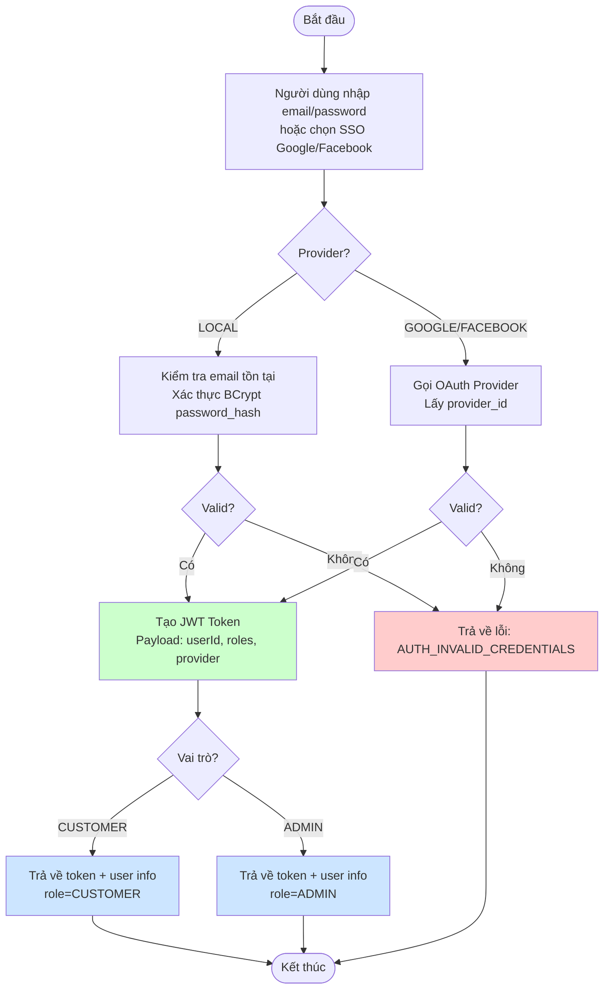

# ACTIVITY DIAGRAMS - STYLEMIND MICROSERVICES

Tài liệu tập hợp tất cả các Activity Diagram (Sơ đồ hoạt động) của hệ thống StyleMind Microservices. Các sơ đồ này được biểu diễn dưới dạng Mermaid.js để dễ dàng render và bảo trì.

---

## Mục lục

1. [Activity Tổng quan hệ thống](#1-activity-tổng-quan-hệ-thống)
2. [Activity Đăng ký / Đăng nhập](#2-activity-đăng-ký--đăng-nhập)
3. [Activity Xem sản phẩm & Tìm kiếm](#3-activity-xem-sản-phẩm--tìm-kiếm)
4. [Activity Quản lý Giỏ hàng (Guest & User)](#4-activity-quản-lý-giỏ-hàng-guest--user)
5. [Activity Gộp giỏ hàng (Merge Cart)](#5-activity-gộp-giỏ-hàng-merge-cart)
6. [Activity Đặt hàng & Thanh toán (Saga Pattern)](#6-activity-đặt-hàng--thanh-toán-saga-pattern)
7. [Activity AI Agent Tư vấn sản phẩm (Anti-Hallucination)](#7-activity-ai-agent-tư-vấn-sản-phẩm-anti-hallucination)
8. [Activity AI Agent Theo dõi đơn hàng](#8-activity-ai-agent-theo-dõi-đơn-hàng)
9. [Activity Quản trị Admin Sản phẩm](#9-activity-quản-trị-admin-sản-phẩm)
10. [Activity Đồng bộ Index AI (Qdrant + Neo4j)](#10-activity-đồng-bộ-index-ai-qdrant--neo4j)
11. [Activity Xử lý lỗi & Retry Policy](#11-activity-xử-lý-lỗi--retry-policy)
12. [Activity JWT Authentication Flow](#12-activity-jwt-authentication-flow)

---

## 1. Activity Tổng quan hệ thống

```mermaid
flowchart TD
    subgraph "Frontend"
        FE[ReactJS Frontend<br/>Port 5173]
    end

    subgraph "API Gateway Layer"
        GW[API Gateway<br/>Spring Cloud Gateway<br/>Port 3000]
    end

    subgraph "Core Services"
        AS[auth-service<br/>Port 8081]
        US[user-service<br/>Port 8082]
        PS[product-service<br/>Port 8083]
        CS[cart-service<br/>Port 8086]
        OS[order-service<br/>Port 8087]
        PAY[payment-service<br/>Port 8088]
        NS[notification-service<br/>Port 8089]
        AIS[ai-agent-service<br/>Port 8085]
    end

    subgraph "Data Layer"
        DB1[(auth_db)]
        DB2[(user_db)]
        DB3[(product_db)]
        DB4[(cart_db)]
        DB5[(order_db)]
        DB6[(payment_db)]
        DB7[(ai_db)]
        DB8[(notification_db)]
        QDRANT[(Qdrant<br/>Vector DB)]
        NEO4J[(Neo4j<br/>Graph DB)]
        MINIO[(MinIO<br/>Object Storage)]
    end

    FE -->|HTTPS Request| GW
    GW -->|Strip Headers + Validate JWT| GW
    GW -->|Route /api/auth/**| AS
    GW -->|Route /api/users/**| US
    GW -->|Route /api/products/**| PS
    GW -->|Route /api/cart/**| CS
    GW -->|Route /api/orders/**| OS
    GW -->|Route /api/payment/**| PAY
    GW -->|Route /api/ai-stylist/**| AIS
    GW -->|Route /api/admin/**| PS

    AS --> DB1
    US --> DB2
    PS --> DB3
    PS --> MINIO
    CS --> DB4
    OS --> DB5
    PAY --> DB6
    AIS --> DB7
    AIS --> QDRANT
    AIS --> NEO4J
    NS --> DB8

    %% Internal Service Calls
    OS -.->|Feign: /internal/payment/process| PAY
    PAY -.->|Callback: /internal/orders/{id}/status| OS
    CS -.->|Feign: /api/cart/merge| CS
    AIS -.->|Feign: /internal/products/{id}| PS
    AIS -.->|Feign: /internal/orders/{id}| OS
    AIS -.->|Function Calling: Runtime API| PS & OS
```

---

## 2. Activity Đăng ký / Đăng nhập



---

## 3. Activity Xem sản phẩm & Tìm kiếm

```mermaid
flowchart TD
    Start([Bắt đầu]) --> ClientReq[Client gửi GET /products<br/>Query: category, search, minPrice, maxPrice, sort, status]

    ClientReq --> GW[API Gateway<br/>Xác thực JWT (tùy chọn)]
    GW --> PS[product-service]

    PS --> CheckCache{Cache hit?}
    CheckCache -->|Có| ReturnCache[Trả về kết quả từ Redis Cache]
    CheckCache -->|Không| QueryDB[Truy vấn product_db<br/>JOIN categories, variants, images]
    
    QueryDB --> ApplyFilters[Áp dụng bộ lọc:<br/>- category_id (đệ quy cây)<br/>- Full-text search trên name/description<br/>- base_price BETWEEN min-max<br/>- status = ACTIVE<br/>- Áp dụng sort]
    
    ApplyFilters --> PageResult[Phân trang kết quả<br/>PageResponse<T>]
    PageResult --> BuildResponse[Xây dựng JSON response<br/>bao gồm variants[], images[]]
    
    BuildResponse --> ReturnCache
    ReturnCache --> ClientResp[Trả về 200 OK + data[]]
    ClientResp --> End([Kết thúc])

    style End fill:#cce5ff
    style ReturnCache fill:#ccffcc
```

---

## 4. Activity Quản lý Giỏ hàng (Guest & User)

```mermaid
flowchart TD
    Start([Bắt đầu]) --> HasAuth{Có JWT Header?}
    
    HasAuth -->|Có| DecodeJWT[Decode JWT lấy userId<br/>cartId = userId]
    HasAuth -->|Không| GuestSession[Lấy X-Guest-Session-Id<br/>cartId = guest_{sessionId}]
    
    DecodeJWT --> CartOp{Thao tác?}
    GuestSession --> CartOp
    
    %% ADD TO CART
    CartOp -->|POST /cart| AddItem[Nhận variantId, quantity<br/>isAiRecommended, sourceBundleId]
    AddItem --> FindCart[Tìm/CREATE cart theo cartId]
    FindCart --> CheckVariant{Tồn tại variant?}
    CheckVariant -->|Không| ErrVariant[Trả lỗi: VARIANT_NOT_FOUND]
    CheckVariant -->|Có| CheckExisting[Kiểm tra cart_item tồn tại<br/>với variantId]
    CheckExisting -->|Có| UpdateQty[Cập nhật quantity += quantity mới<br/>Cập nhật isAiRecommended, sourceBundleId]
    CheckExisting -->|Không| CreateItem[Tạo mới CartItem<br/>quantity, isAiRecommended, sourceBundleId]
    UpdateQty --> SaveCart[Lưu CartItem]
    CreateItem --> SaveCart
    SaveCart --> GetCart[GET /cart<br/>Tính totalAmount, totalQuantity]
    GetCart --> ReturnCart[Trả về CartResponse]
    
    %% UPDATE QUANTITY
    CartOp -->|PUT /cart/{itemId}| UpdateItem[Nhận quantity mới]
    UpdateItem --> FindItem[Tìm CartItem by itemId]
    FindItem --> CheckOwnership{cartId khớp?}
    CheckOwnership -->|Không| ErrAccess[Trả lỗi: ACCESS_DENIED]
    CheckOwnership -->|Có| QtyCheck{quantity > 0?}
    QtyCheck -->|Không| DeleteItem[Xóa CartItem]
    QtyCheck -->|Có| UpdateQty2[Cập nhật quantity]
    DeleteItem --> SaveCart2[Lưu]
    UpdateQty2 --> SaveCart2
    SaveCart2 --> GetCart
    
    %% DELETE
    CartOp -->|DELETE /cart/{itemId}| DeleteItem2[Tìm CartItem]
    DeleteItem2 --> CheckOwnership2{cartId khớp?}
    CheckOwnership2 -->|Có| DeleteItem3[Xóa CartItem]
    DeleteItem3 --> SaveCart3[Lưu]
    SaveCart3 --> GetCart
    
    ReturnCart --> End([Kết thúc])
    ErrVariant --> End
    ErrAccess --> End

    style End fill:#cce5ff
    style ErrVariant fill:#ffcccc
    style ErrAccess fill:#ffcccc
    style ReturnCart fill:#ccffcc
```

---

## 5. Activity Gộp giỏ hàng (Merge Cart)

```mermaid
flowchart TD
    Start([Bắt đầu]) --> LoginSuccess[User đăng nhập thành công<br/>Nhận JWT + guestSessionId]
    
    LoginSuccess --> MergeReq[Client POST /cart/merge<br/>Body: {guest_session_id}]
    MergeReq --> GW[API Gateway<br/>Decode JWT -> X-User-Id]
    GW --> CS[cart-service]
    
    CS --> FindGuestCart[Tìm guest cart:<br/>cartId = guest_{guestSessionId}]
    FindGuestCart --> GuestExists{Guest cart tồn tại?}
    GuestExists -->|Không| ReturnCurrent[Trả về cart hiện tại của user]
    
    GuestExists -->|Có| FindUserCart[Tìm user cart:<br/>cartId = userId]
    FindUserCart --> UserExists{User cart tồn tại?}
    
    UserExists -->|Không| RenameCart[Đổi ID guest cart -> userId<br/>Set userId, is_guest=false]
    RenameCart --> ReturnMerged[Trả về cart đã gộp]
    
    UserExists -->|Có| MergeItems[Duyệt items của guest cart]
    MergeItems --> ForEachItem{Với mỗi item}
    ForEachItem --> FindMatch[Tìm item trong user cart<br/>cùng variantId]
    FindMatch -->|Tồn tại| CombineQty[Cộng dồn quantity<br/>userItem.qty += guestItem.qty]
    FindMatch -->|Không| MoveItem[Chuyển item sang user cart<br/>cartId = userId]
    CombineQty --> SaveUserItem[Lưu userItem]
    MoveItem --> SaveGuestItem[Lưu guestItem với cartId mới]
    SaveUserItem --> NextItem
    SaveGuestItem --> NextItem
    NextItem --> MoreItems{Còn item?}
    MoreItems -->|Có| ForEachItem
    MoreItems -->|Không| DeleteGuestCart[Xóa guest cart]
    DeleteGuestCart --> ReturnMerged
    
    ReturnCurrent --> End([Kết thúc])
    ReturnMerged --> End

    style End fill:#cce5ff
    style ReturnMerged fill:#ccffcc
    style RenameCart fill:#ffe5cc
```

---

## 6. Activity Đặt hàng & Thanh toán (Saga Pattern)

```mermaid
flowchart TD
    Start([Bắt đầu]) --> ClientOrder[Client POST /orders<br/>Body: shipping_address, payment_method, transaction_id]
    
    ClientOrder --> GW[API Gateway<br/>Validate JWT -> X-User-Id, X-User-Roles]
    GW --> OS[order-service]
    
    OS --> GetCart[Feign GET /api/cart<br/>Authorization: Bearer token]
    GetCart --> CartEmpty{Giỏ hàng trống?}
    CartEmpty -->|Có| ErrEmpty[Trả lỗi: CART_EMPTY]
    CartEmpty -->|Không| CreateOrder[Tạo Order mới<br/>status = PENDING<br/>totalAmount = cart.totalAmount]
    
    CreateOrder --> SaveOrder[Lưu Order]
    SaveOrder --> CreateItems[Tạo OrderItems từ cart items<br/>snapshot: price_at_purchase, is_ai_conversion, source_bundle_id]
    CreateItems --> SaveItems[Lưu OrderItems]
    
    SaveItems --> CheckPayment{Phương thức thanh toán?}
    
    %% ONLINE PAYMENT
    CheckPayment -->|online_simulated| CheckTxId{Có transactionId?}
    CheckTxId -->|Không| ErrTx[Trả lỗi: INVALID_PAYMENT]
    CheckTxId -->|Có| CallPayment[Feign POST /internal/payment/process<br/>Body: transactionId, orderId, amount]
    
    CallPayment --> PayResult{Kết quả thanh toán}
    PayResult -->|THẤT BẠI| RollbackOrder[Update order status = CANCELLED<br/>Hoặc COMPENSATING_ROLLBACK]
    RollbackOrder --> ErrPayment[Trả lỗi: PAYMENT_FAILED]
    
    PayResult -->|THÀNH CÔNG| CommitOrder[Update order status = FULFILLED]
    
    %% COD
    CheckPayment -->|cod| CommitOrder
    
    CommitOrder --> ClearCart[Feign POST /api/cart/merge<br/>Body: {guest_session_id: ""}]
    ClearCart --> ReturnOrder[Trả về OrderResponse<br/>status = FULFILLED / PENDING (COD)]
    
    ReturnOrder --> End([Kết thúc])
    ErrEmpty --> End
    ErrTx --> End
    ErrPayment --> End

    %% Internal Callback from Payment Service
    subgraph "Payment Callback"
        PayCallback[Payment Service Callback<br/>POST /internal/orders/{id}/status<br/>Body: {order_status}]
        PayCallback --> UpdateOS[Update order status]
        UpdateOS --> End
    end

    style End fill:#cce5ff
    style CommitOrder fill:#ccffcc
    style RollbackOrder fill:#ffcccc
    style ReturnOrder fill:#ccffcc
    style ErrEmpty fill:#ffcccc
    style ErrTx fill:#ffcccc
    style ErrPayment fill:#ffcccc
```

---

## 7. Activity AI Agent Tư vấn sản phẩm (Anti-Hallucination)

```mermaid
flowchart TD
    Start([Bắt đầu]) --> UserMsg[User gửi tin nhắn<br/>POST /api/ai-stylist/chat<br/>Body: message, conversation_id]
    
    UserMsg --> GW[API Gateway<br/>Rate Limit: 5 req/phút<br/>Strip Headers + Validate JWT]
    GW --> AIS[ai-agent-service]
    
    AIS --> SessionMgmt{Conversation ID tồn tại?}
    SessionMgmt -->|Có| LoadSession[Tải ChatSession]
    SessionMgmt -->|Không| NewSession[Tạo mới ChatSession<br/>Lưu weather context nếu có]
    LoadSession --> SaveUserMsg[Lưu User Message<br/>sender_type=USER]
    NewSession --> SaveUserMsg
    
    SaveUserMsg --> DetectIntent[Phát hiện Intent<br/>- product_recommendation<br/>- outfit_recommendation<br/>- order_tracking<br/>- general_chat]
    
    %% PRODUCT RECOMMENDATION
    DetectIntent -->|product/outfit| HybridSearch[Thực hiện Hybrid Search]
    
    subgraph "Hybrid Search"
        HS1[Vector Search (Qdrant)<br/>Semantic similarity<br/>Weight: 35%]
        HS2[Keyword Search (Postgres FTS)<br/>Exact match<br/>Weight: 25%]
        HS3[Graph Traversal (Neo4j)<br/>Fashion rules/relations<br/>Weight: 25%]
        HS4[Personalization<br/>Style DNA user<br/>Weight: 15%]
        HS1 --> CombineScores[Tính điểm tổng hợp<br/>Final Score = Σ(Score × Weight)]
        HS2 --> CombineScores
        HS3 --> CombineScores
        HS4 --> CombineScores
        CombineScores --> FilterThreshold[Lọc Final Score ≥ 0.65]
        FilterThreshold --> TopK[Lấy Top 10 sản phẩm]
    end
    
    TopK --> CheckProducts{Có sản phẩm?}
    CheckProducts -->|Không| NoResult[Trả lời: Không tìm thấy sản phẩm phù hợp]
    CheckProducts -->|Có| RuntimeFetch[Function Calling: Gọi Runtime API]
    
    subgraph "Runtime API Fetching (Anti-Hallucination)"
        RF1[Gọi product-service<br/>GET /internal/products/{id}...<br/>→ Lấy base_price chính xác]
        RF2[Gọi order-service<br/>GET /internal/orders/{id}...<br/>→ Lấy trạng thái đơn (ownership check)]
        RF1 --> BuildContext[Xây dựng Context chính xác 100%]
        RF2 --> BuildContext
    end
    
    BuildContext --> CallLLM[Gửi Context + User Query đến LLM<br/>(Gemini/GPT)]
    CallLLM --> LLMResponse[LLM sinh câu trả lời<br/>+ recommended_products[]<br/>+ style_tips[]]
    
    LLMResponse --> CreateBundle[Tạo AiCuratedBundle<br/>Lưu justification_summary]
    CreateBundle --> SaveBundleItems[Lưu AiCuratedBundleItems<br/>product_ids]
    SaveBundleItems --> SaveAiMsg[Lưu AI Message<br/>sender_type=AI, has_product_block=true]
    SaveAiMsg --> LogAnalytics[Ghi ai_analytics_logs<br/>IMPRESSION cho bundle]
    LogAnalytics --> ReturnAI[Trả về ChatResponse<br/>message, products[], bundle, tips]
    
    %% ORDER TRACKING
    DetectIntent -->|order_tracking| ExtractOrderID[Trích xuất OrderID từ message]
    ExtractOrderID --> CallOrderSvc[Feign GET /internal/orders/{id}<br/>X-User-Id từ Gateway]
    CallOrderSvc --> OwnershipCheck{userId khớp?}
    OwnershipCheck -->|Không| AccessDenied[403 Forbidden]
    OwnershipCheck -->|Có| GetStatus[Lấy order_status]
    GetStatus --> BuildTrackingMsg[Tạo câu trả lời tracking]
    BuildTrackingMsg --> SaveAiMsg2[Lưu AI Message]
    SaveAiMsg2 --> ReturnAI
    
    %% GENERAL CHAT
    DetectIntent -->|general_chat| GeneralLLM[LLM trả lời thông thường<br/>không cần product data]
    GeneralLLM --> SaveAiMsg3[Lưu AI Message]
    SaveAiMsg3 --> ReturnAI
    
    NoResult --> SaveAiMsg4[Lưu AI Message]
    SaveAiMsg4 --> ReturnAI
    AccessDenied --> SaveAiMsg5[Lưu AI Message: Từ chối truy cập]
    SaveAiMsg5 --> ReturnAI
    
    ReturnAI --> End([Kết thúc])

    style End fill:#cce5ff
    style ReturnAI fill:#ccffcc
    style RuntimeFetch fill:#ffe5cc
    style HybridSearch fill:#e5ccff
    style AccessDenied fill:#ffcccc
```

---

## 8. Activity AI Agent Theo dõi đơn hàng

```mermaid
flowchart TD
    Start([Bắt đầu]) --> UserMsg[User hỏi: "Đơn ORD-123 của tôi thế nào?"]
    
    UserMsg --> GW[API Gateway<br/>Decode JWT -> X-User-Id = usr_123]
    GW --> AIS[ai-agent-service]
    
    AIS --> ExtractID[Regex extract OrderID<br/>Pattern: ORD-\d{4}-\d+]
    ExtractID --> FoundID{Thấy OrderID?}
    FoundID -->|Không| AskClarify[Hỏi lại: "Vui lòng cung cấp mã đơn hàng"]
    
    FoundID -->|Có| CallOrder[Feign GET /internal/orders/ORD-123<br/>Header: X-User-Id: usr_123]
    
    CallOrder --> OrderSvc[order-service]
    OrderSvc --> FindOrder[Tìm order by ID]
    FindOrder --> OrderExists{Tồn tại?}
    OrderExists -->|Không| NotFound[Trả 404: ORDER_NOT_FOUND]
    
    OrderExists -->|Có| CheckOwner[So sánh order.userId vs X-User-Id]
    CheckOwner --> OwnerMatch{Khớp?}
    OwnerMatch -->|Không| Deny[Trả 403: ACCESS_DENIED]
    OwnerMatch -->|Có| GetStatus[Lấy order_status]
    
    GetStatus --> BuildResp[AIS build câu trả lời<br/>dựa trên status thực tế]
    BuildResp --> SaveLog[Lưu AI Message]
    SaveLog --> ReturnResp[Trả về cho User]
    
    NotFound --> ReturnErr[Thông báo: Không tìm thấy đơn]
    Deny --> ReturnErr2[Thông báo: Không có quyền xem đơn này]
    AskClarify --> ReturnResp
    
    ReturnResp --> End([Kết thúc])
    ReturnErr --> End
    ReturnErr2 --> End

    style End fill:#cce5ff
    style ReturnResp fill:#ccffcc
    style Deny fill:#ffcccc
    style NotFound fill:#ffcccc
```

---

## 9. Activity Quản trị Admin Sản phẩm

```mermaid
flowchart TD
    Start([Bắt đầu]) --> AdminAuth[Admin đăng nhập<br/>JWT có role=ADMIN]
    
    AdminAuth --> GW[API Gateway<br/>Check X-User-Roles contains ROLE_ADMIN]
    GW --> PS[product-service]
    
    PS --> AdminAction{Action?}
    
    %% CREATE PRODUCT
    AdminAction -->|POST /admin/products| CreateProd[Nhận: name, description, base_price,<br/>category_id, aesthetic_style,<br/>target_demographic, seasonal_property,<br/>images[] (multipart)]
    CreateProd --> UploadImgs[Upload ảnh lên MinIO<br/>bucket: stylemind-products]
    UploadImgs --> SaveProduct[Lưu Product vào product_db<br/>status = ACTIVE]
    SaveProduct --> SaveImages[Lưu product_images<br/>với URLs MinIO]
    SaveImages --> TriggerIndex[Gửi ai_index_job<br/>target_type=PRODUCT, operation=CREATE]
    TriggerIndex --> ReturnCreated[Trả 201 Created]
    
    %% UPDATE PRODUCT
    AdminAction -->|PUT /admin/products/{id}| UpdateProd[Nhận fields cần update]
    UpdateProd --> CheckProd{Tồn tại?}
    CheckProd -->|Không| Err404[404 Not Found]
    CheckProd -->|Có| ApplyUpdate[Cập nhật fields<br/>nếu có images mới -> upload MinIO]
    ApplyUpdate --> TriggerIndexUpd[Gửi ai_index_job<br/>target_type=PRODUCT, operation=UPDATE]
    TriggerIndexUpd --> ReturnUpdated[Trả 200 OK]
    
    %% DELETE PRODUCT
    AdminAction -->|DELETE /admin/products/{id}| DeleteProd[Kiểm tra tồn tại]
    DeleteProd --> DelImages[Xóa file MinIO<br/>theo product_images.image_url]
    DelImages --> DelDB[Xóa product_cascade<br/>(variants, images)]
    DelDB --> TriggerIndexDel[Gửi ai_index_job<br/>target_type=PRODUCT, operation=DELETE]
    TriggerIndexDel --> ReturnDeleted[Trả 204 No Content]
    
    %% ADD VARIANT
    AdminAction -->|POST /admin/products/{id}/variants| AddVariant[Nhận: sku, size, color,<br/>material, price_override]
    AddVariant --> CheckSku{SKU unique?}
    CheckSku -->|Không| ErrSku[400: SKU đã tồn tại]
    CheckSku -->|Có| SaveVariant[Lưu product_variant]
    SaveVariant --> TriggerIndexVar[Gửi ai_index_job<br/>target_type=PRODUCT, operation=UPDATE]
    TriggerIndexVar --> ReturnVariant[Trả 201 Created]
    
    %% MANAGE CATEGORIES
    AdminAction -->|POST /admin/categories| AddCat[Nhận: name, parent_id, slug]
    AddCat --> SaveCat[Lưu category]
    SaveCat --> ReturnCat[Trả 201 Created]
    
    ReturnCreated --> End([Kết thúc])
    ReturnUpdated --> End
    ReturnDeleted --> End
    ReturnVariant --> End
    ReturnCat --> End
    Err404 --> End
    ErrSku --> End

    style End fill:#cce5ff
    style TriggerIndex fill:#ffe5cc
    style TriggerIndexUpd fill:#ffe5cc
    style TriggerIndexDel fill:#ffe5cc
    style TriggerIndexVar fill:#ffe5cc
```

---

## 10. Activity Đồng bộ Index AI (Qdrant + Neo4j)

```mermaid
flowchart TD
    Start([Bắt đầu]) --> Trigger[Trigger Index Job<br/>- Admin POST /admin/ai/index/products/reindex<br/>- Hoặc ai_index_jobs Scheduler quét PENDING]
    
    Trigger --> AIS[ai-agent-service]
    AIS --> CreateJob[Tạo ai_index_jobs record<br/>status = PROCESSING]
    
    CreateJob --> FetchProducts[Feign GET /internal/products<br/>Lấy tất cả sản phẩm ACTIVE]
    
    FetchProducts --> ForEachProd{Với mỗi Product}
    
    %% QDRANT INDEXING
    ForEachProd --> BuildVectorDoc[Xây dựng document text:<br/>name + description + aesthetic_style +<br/>target_demographic + seasonal_property +<br/>categories + variants(size,color,material)]
    BuildVectorDoc --> EmbedVector[Gọi Embedding Model<br/>text-embedding-3-small/large<br/>→ Vector 1536/3072 dims]
    EmbedVector --> UpsertQdrant[Upsert vào Qdrant Collection<br/>"products"<br/>payload: product_id, name, price, category...]
    
    %% NEO4J INDEXING
    UpsertQdrant --> Neo4jNodes[Tạo/Cập nhật Nodes Neo4j:<br/>(Product), (Category), (Color), (Material)]
    Neo4jNodes --> Neo4jRels[Tạo Relationships:<br/>Product-[:BELONGS_TO]->Category<br/>Product-[:HAS_COLOR]->Color<br/>Product-[:MADE_OF]->Material<br/>Product-[:MATCHES_STYLE]->Style<br/>Product-[:SUITABLE_FOR]->Occasion<br/>Product-[:SUITABLE_FOR_SEASON]->Season<br/>Product-[:FITS_BODY_TYPE]->BodyType]
    
    Neo4jRels --> NextProd
    NextProd --> MoreProd{Còn sản phẩm?}
    MoreProd -->|Có| ForEachProd
    MoreProd -->|Không| UpdateJobSuccess[Update ai_index_jobs<br/>status = COMPLETED]
    
    UpdateJobSuccess --> End([Kết thúc])
    
    %% ERROR HANDLING
    EmbedVector -.->|Lỗi| HandleError1[Ghi lỗi vào job.last_error_message<br/>retry_count++]
    UpsertQdrant -.->|Lỗi| HandleError2[Ghi lỗi<br/>retry_count++]
    Neo4jNodes -.->|Lỗi| HandleError3[Ghi lỗi<br/>retry_count++]
    
    HandleError1 --> CheckRetry{retry_count < 3?}
    HandleError2 --> CheckRetry
    HandleError3 --> CheckRetry
    
    CheckRetry -->|Có| ScheduleRetry[Scheduler retry sau<br/>2^retry_count * 5s<br/>(10s, 20s, 40s)]
    ScheduleRetry --> FetchProducts
    
    CheckRetry -->|Không| UpdateJobFail[Update status = FAILED<br/>Gửi alert qua notification-service]
    UpdateJobFail --> End

    style End fill:#cce5ff
    style UpdateJobSuccess fill:#ccffcc
    style UpdateJobFail fill:#ffcccc
    style ScheduleRetry fill:#ffe5cc
```

---

## 11. Activity Xử lý lỗi & Retry Policy

```mermaid
flowchart TD
    Start([Bắt đầu]) --> JobFailed[ai_index_jobs status = FAILED<br/>retry_count = 0..2]
    
    JobFailed --> Scheduler[Scheduler chạy mỗi 1 phút<br/>Quét jobs FAILED với retry_count < 3]
    
    Scheduler --> CalcDelay[Tính delay:<br/>delay = 2^retry_count * 5 giây<br/>Lần 1: 10s, Lần 2: 20s, Lần 3: 40s]
    
    CalcDelay --> Wait[Chờ delay giây]
    Wait --> RetryJob[Thử lại job<br/>status = PROCESSING]
    
    RetryJob --> ExecuteExec[Thực hiện indexing<br/>Qdrant + Neo4j]
    
    ExecuteExec --> ExecResult{Kết quả}
    ExecResult -->|Thành công| UpdateComplete[Update status = COMPLETED]
    ExecResult -->|Thất bại| IncRetry[retry_count++]
    
    IncRetry --> CheckMaxRetry{retry_count >= 3?}
    CheckMaxRetry -->|Chưa| ScheduleNext[Lên lịch retry tiếp theo]
    CheckMaxRetry -->|Đã| MarkDeadLetter[status = FAILED (cố định)<br/>last_error_message = lỗi cuối<br/>Gửi alert Admin qua notification-service]
    
    ScheduleNext --> CalcDelay
    UpdateComplete --> End([Kết thúc])
    MarkDeadLetter --> End

    style End fill:#cce5ff
    style UpdateComplete fill:#ccffcc
    style MarkDeadLetter fill:#ffcccc
    style ScheduleNext fill:#ffe5cc
```

---

## 12. Activity JWT Authentication Flow

```mermaid
flowchart TD
    Start([Bắt đầu]) --> ClientReq[Client request có Header:<br/>Authorization: Bearer <token>]
    
    ClientReq --> GW[API Gateway nhận request]
    
    GW --> StripHeaders[STRIP HEADERS:<br/>Xóa X-User-Id, X-User-Roles nếu có]
    
    StripHeaders --> HasToken{Có Authorization Header?}
    HasToken -->|Không| PublicAccess[Cho phép truy cập public endpoints<br/>/products, /categories, /auth/**]
    HasToken -->|Có| ValidateJWT[Validate JWT:<br/>- Chữ ký HS256 với JWT_SECRET<br/>- Kiểm tra exp (hết hạn)<br/>- Kiểm tra iss, aud]
    
    ValidateJWT --> Valid{Hợp lệ?}
    Valid -->|Không| Reject[Trả 401: AUTH_TOKEN_EXPIRED<br/>hoặc AUTH_INVALID_CREDENTIALS]
    Valid -->|Có| ExtractClaims[Extract claims:<br/>userId, roles, provider]
    
    ExtractClaims --> AppendHeaders[APPEND HEADERS:<br/>X-User-Id = userId<br/>X-User-Roles = roles]
    
    AppendHeaders --> CheckPath{Endpoint cần quyền?}
    CheckPath -->|/admin/**| CheckAdmin{roles chứa ROLE_ADMIN?}
    CheckAdmin -->|Không| Forbidden[Trả 403: AUTH_ACCESS_DENIED]
    CheckAdmin -->|Có| Forward[Forward đến service]
    
    CheckPath -->|/api/ai-stylist/chat| CheckAIRateLimit{< 5 req/phút?}
    CheckAIRateLimit -->|Vượt quá| RateLimitErr[Trả 429: AI_RATE_LIMIT_EXCEEDED]
    CheckAIRateLimit -->|OK| Forward
    
    CheckPath -->|Khác| Forward
    
    Forward --> Downstream[Gọi Microservice BE<br/>Với X-User-Id, X-User-Roles]
    
    Downstream --> ServiceLogic[Service logic nghiệp vụ<br/>Đọc userId từ Header]
    
    ServiceLogic --> ReturnResp[Trả về Response]
    
    PublicAccess --> End([Kết thúc])
    Reject --> End
    Forbidden --> End
    RateLimitErr --> End
    ReturnResp --> End

    style End fill:#cce5ff
    style ReturnResp fill:#ccffcc
    style Reject fill:#ffcccc
    style Forbidden fill:#ffcccc
    style RateLimitErr fill:#ffcccc
    style StripHeaders fill:#ffe5cc
    style AppendHeaders fill:#cce5ff
```

---

## Cách render Mermaid

### VS Code
1. Cài extension: **Markdown Preview Mermaid Support**
2. Mở file `.md` này → `Ctrl+Shift+V` để preview

### GitHub/GitLab
- Tự động render khi xem file `.md` trên web

### Mermaid Live Editor
- Copy code block mermaid vào: https://mermaid.live/

### CLI (npx)
```bash
npx -p @mermaid-js/mermaid-cli mmdc -i docs/ACTIVITY_DIAGRAMS.md -o diagrams/
```

---

## Mapping với State Machines (DATA_MODEL_DOCUMENTATION)

| Activity Diagram | State Machine liên quan |
|-----------------|------------------------|
| Đăng ký/Đăng nhập | User: Belongs to auth-service users table |
| Giỏ hàng | Cart: ACTIVE → MERGED → ABANDONED |
| Merge Cart | Cart: ACTIVE → MERGED |
| Đặt hàng & Thanh toán | Order: PENDING → PROCESSING → FULFILLED/CANCELLED/COMPENSATING_ROLLBACK |
| Thanh toán | Payment: PENDING → COMPLETED/FAILED → REFUNDED |
| Index AI Job | ai_index_jobs: PENDING → PROCESSING → COMPLETED/FAILED |

---

## Legend

```
┌─────────────────────────────────────────────────────┐
│  Shape          │ Meaning                          │
├─────────────────────────────────────────────────────┤
│  [ ]            │ Process/Activity                 │
│  ( )            │ Start/End                        │
│  { }            │ Decision/Condition               │
│  .->            │ Async/Feign call                 │
│  -->            │ Sync flow                        │
│  fill:#ccffcc   │ Success path                     │
│  fill:#ffcccc   │ Error/Failure path               │
│  fill:#ffe5cc   │ Warning/Retry path               │
│  fill:#cce5ff   │ Info/End state                   │
│  fill:#e5ccff   │ Complex sub-process              │
└─────────────────────────────────────────────────────┘
```

---

*Tài liệu này được sinh tự động từ các tài liệu kiến trúc: MICROSERVICE_ARCHITECTURE.md, API_CONTRACT.md, DEPLOYMENT_GUIDE.md, MIGRATION_ROADMAP.md. Cập nhật lần cuối: 2026-06-17*