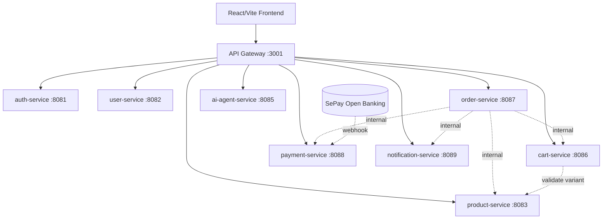

# System Architecture

## Loại hệ thống
Microservices + database per service + API Gateway + SPA frontend. Lý do chọn: các capability (auth, catalog, cart, order, payment, AI...) có vòng đời và tốc độ thay đổi khác nhau, muốn scale/deploy độc lập và có chỗ để cắm AI pipeline sau này.

> **Khi nào KHÔNG nên microservices:** nếu đây chỉ là đồ án nhỏ 1–2 người, một **modular monolith** (một app, tách package theo module) sẽ nhanh hơn và ít overhead vận hành hơn nhiều. StyleMind chọn microservices vì mục tiêu học tập và mô phỏng hệ thống thật — hãy ý thức cái giá: nhiều DB, nhiều deploy, eventual consistency, cần observability.

## Sơ đồ tổng quan

## Danh sách service
| Service | Port | DB | Trách nhiệm |
|---|---|---|---|
| api-gateway | 3001 | — | Routing, CORS, JWT validation, admin guard, inject user context. |
| auth-service | 8081 | auth_db | Register/login, forgot/reset password, admin account mgmt (+ self-protection). |
| user-service | 8082 | user_db | Style profile, delivery addresses (lazy-init). |
| product-service | 8083 | product_db | Category/product/variant/image, internal variant snapshot (giá authoritative). |
| ai-agent-service | 8085 | ai_db | AI chat, recommendation, AI index jobs. |
| cart-service | 8086 | cart_db | Guest/auth cart, merge, clear. |
| order-service | 8087 | order_db | Checkout orchestration, order state machine, admin order mgmt. |
| payment-service | 8088 | payment_db | COD, SePay VietQR, webhook handler, transaction logs. |
| notification-service | 8089 | notification_db | Notification logs, customer/admin notification. |

## Trust boundary (rất quan trọng)
- Frontend chỉ nói chuyện với Gateway; **không** gọi trực tiếp port service, **không** gọi `/internal/v1/**`.
- Gateway validate JWT rồi **inject** `X-User-Id` / `X-User-Roles` xuống service. Frontend **không được** tự gửi 2 header này.
- Gọi nội bộ service-to-service yêu cầu `X-Internal-Token`.
- Webhook SePay là public nhưng verify bằng chữ ký/API key của SePay (không dùng JWT).

## Trade-off tóm tắt
| Ưu | Nhược |
|---|---|
| Scale/deploy độc lập, ranh giới nghiệp vụ rõ | Vận hành phức tạp (nhiều DB, nhiều deploy) |
| Dễ cắm AI pipeline sau | Phải chấp nhận eventual consistency + saga |
| Fault isolation | Cần observability (log/metric/trace) mới debug nổi |
