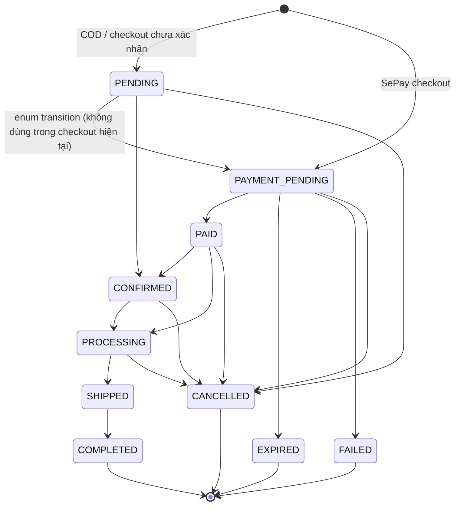

# Order State Machine

Mục tiêu: chặn cập nhật trạng thái đơn hàng không hợp lệ (admin không "loạn trạng thái"). Nguyên tắc: **chỉ tiến, không lùi**; trạng thái terminal thì đóng.

## Sơ đồ trạng thái


## Bảng transition hợp lệ
| Từ | Sang | Ai kích hoạt |
|---|---|---|
| PENDING | PAYMENT_PENDING, CONFIRMED, CANCELLED | Checkout enum; COD checkout chuyển ngay sang `CONFIRMED` với actor là user ID, customer hủy bằng user ID |
| PAYMENT_PENDING | PAID | SePay webhook sau khi đối soát thành công (`PAYMENT_WEBHOOK`) |
| PAYMENT_PENDING | EXPIRED | Timeout job sau khi payment-service xác nhận expire (`SYSTEM_TIMEOUT_JOB`) |
| PAYMENT_PENDING | FAILED | SePay webhook đã match transaction nhưng sai số tiền (`PAYMENT_WEBHOOK`) |
| PAYMENT_PENDING | CANCELLED | Customer hủy sau khi payment-service expire thành công (actor là user ID) |
| PAID | CONFIRMED, PROCESSING, CANCELLED | Admin (actor là principal user ID) |
| CONFIRMED | PROCESSING, CANCELLED | Admin (actor là principal user ID) |
| PROCESSING | SHIPPED, CANCELLED | Admin (actor là principal user ID) |
| SHIPPED | COMPLETED | Admin (actor là principal user ID) |
| COMPLETED / CANCELLED / EXPIRED / FAILED | (terminal) | — |

## Enforce trong Spring Boot (order-service)
`entity/OrderStatus.java` khai báo enum và dùng `allowedTransitions()`/`canTransitionTo()` để trả về đúng tập transition ở trên.
```java
public enum OrderStatus {
    PENDING, PAYMENT_PENDING, PAID, CONFIRMED,
    PROCESSING, SHIPPED, COMPLETED, CANCELLED, EXPIRED, FAILED;

    private static final Map<OrderStatus, Set<OrderStatus>> ALLOWED = Map.of(
        PENDING,         Set.of(PAYMENT_PENDING, CONFIRMED, CANCELLED),
        PAYMENT_PENDING, Set.of(PAID, EXPIRED, FAILED, CANCELLED),
        PAID,            Set.of(CONFIRMED, PROCESSING, CANCELLED),
        CONFIRMED,       Set.of(PROCESSING, CANCELLED),
        PROCESSING,      Set.of(SHIPPED, CANCELLED),
        SHIPPED,         Set.of(COMPLETED),
        COMPLETED, Set.of(), CANCELLED, Set.of(), EXPIRED, Set.of(), FAILED, Set.of()
    );
    public boolean canTransitionTo(OrderStatus target) {
        return ALLOWED.getOrDefault(this, Set.of()).contains(target);
    }
}
```
`service/OrderStatusService.java` là single funnel cho mọi lần ghi trạng thái. Method nhận order ID dạng `String`, target status và actor ID; nó validate transition, lưu order, rồi ghi `OrderStatusAuditLog` trong cùng transaction. Audit record hiện lưu `orderId`, `actorId`, `fromStatus`, `toStatus`, `createdAt`/`updatedAt`; chưa có reason, source hay correlation ID.
```java
public Order changeStatus(String orderId, OrderStatus target, String actorId) {
    Order order = orderRepository.findById(orderId)
        .orElseThrow(() -> new BusinessException("ORDER_NOT_FOUND", "Order not found", 404));
    OrderStatus current = order.getOrderStatus();
    if (!order.getOrderStatus().canTransitionTo(target)) {
        throw new InvalidOrderStatusTransitionException(order.getOrderStatus(), target); // -> 409
    }
    order.setOrderStatus(target);
    Order saved = orderRepository.save(order);
    recordAudit(actorId, order.getId(), current, target);
    return saved;
}
```
> **Quy tắc:** MỌI đường đổi trạng thái (admin, webhook, timeout job) phải đi qua `changeStatus()`. Không set status trực tiếp lên entity ở bất kỳ đâu khác.

## Ghi chú SePay
- Webhook SePay chỉ xác nhận thanh toán: `PAYMENT_PENDING -> PAID`.
- Webhook **không** tự chuyển `PAID -> PROCESSING`.
- `PAID -> CONFIRMED`, `PAID -> PROCESSING` hoặc `PAID -> CANCELLED` là các transition admin được enum cho phép; Order Service không tự gọi refund khi đổi sang `CANCELLED`.
- Sai số tiền chỉ chuyển order sang `FAILED` khi webhook đã match đúng transaction reference; webhook không match chỉ ghi event `NO_MATCHING_ORDER` và không callback order-service.
- Timeout job chuyển `PAYMENT_PENDING -> EXPIRED` và expire payment tương ứng ở `payment-service`; timeout job không chuyển sang `CANCELLED`.
- Customer cancellation là flow riêng: payment pending phải expire thành công trước, sau đó order mới chuyển `PAYMENT_PENDING -> CANCELLED`.
- Late webhook sau khi order/payment đã `EXPIRED` hoặc `CANCELLED` chỉ được ghi nhận để review, không được kéo order quay lại `PAID`.
