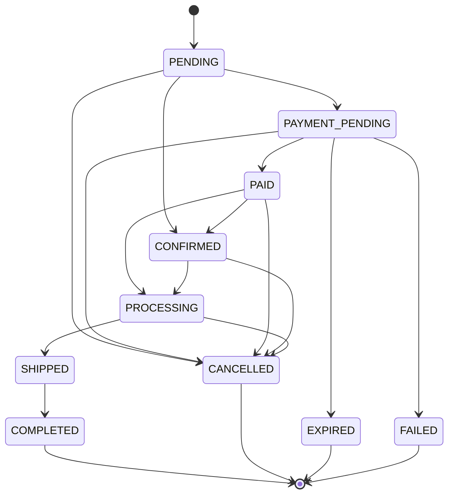

# Order State Machine

Mục tiêu: chặn cập nhật trạng thái đơn hàng không hợp lệ (admin không "loạn trạng thái"). Nguyên tắc: **chỉ tiến, không lùi**; trạng thái terminal thì đóng.

## Sơ đồ trạng thái


## Bảng transition hợp lệ
| Từ | Sang | Ai kích hoạt |
|---|---|---|
| PENDING | PAYMENT_PENDING, CONFIRMED, CANCELLED | System (COD→CONFIRMED), Customer |
| PAYMENT_PENDING | PAID, EXPIRED, FAILED, CANCELLED | SePay webhook, System (timeout), Customer |
| PAID | CONFIRMED, PROCESSING, CANCELLED | Admin |
| CONFIRMED | PROCESSING, CANCELLED | Admin |
| PROCESSING | SHIPPED, CANCELLED | Admin |
| SHIPPED | COMPLETED | Admin |
| COMPLETED / CANCELLED / EXPIRED / FAILED | (terminal) | — |

## Enforce trong Spring Boot (order-service)
`domain/OrderStatus.java`
```java
public enum OrderStatus {
    PENDING, PAYMENT_PENDING, PAID, CONFIRMED,
    PROCESSING, SHIPPED, COMPLETED, CANCELLED, EXPIRED, FAILED;

    private static final Map<OrderStatus, Set<OrderStatus>> ALLOWED = Map.of(
        PENDING,         Set.of(PAYMENT_PENDING, CONFIRMED, CANCELLED),
        PAYMENT_PENDING, Set.of(PAID, EXPIRED, FAILED, CANCELLED),
        PAID,            Set.of(CONFIRMED, PROCESSING, CANCELLED),
        CONFIRMED,       Set.of(PROCESSING, CANCELLED),
        PROCESSING,      Set.of(SHIPPED, CANCELLED),
        SHIPPED,         Set.of(COMPLETED),
        COMPLETED, Set.of(), CANCELLED, Set.of(), EXPIRED, Set.of(), FAILED, Set.of()
    );
    public boolean canTransitionTo(OrderStatus target) {
        return ALLOWED.getOrDefault(this, Set.of()).contains(target);
    }
}
```
`service/OrderStatusService.java`
```java
public void changeStatus(Long orderId, OrderStatus target, Long actorId) {
    Order order = orderRepository.findById(orderId)
        .orElseThrow(() -> new OrderNotFoundException(orderId));
    if (!order.getStatus().canTransitionTo(target)) {
        throw new InvalidOrderStatusTransitionException(order.getStatus(), target); // -> 409
    }
    order.setStatus(target);
    orderRepository.save(order);
    // TODO: audit log (actorId, from, to, timestamp)
}
```
> **Quy tắc:** MỌI đường đổi trạng thái (admin, webhook, timeout job) phải đi qua `changeStatus()`. Không set status trực tiếp lên entity ở bất kỳ đâu khác.

## Ghi chú SePay
- Webhook SePay chỉ xác nhận thanh toán: `PAYMENT_PENDING -> PAID`.
- Webhook **không** tự chuyển `PAID -> PROCESSING`.
- `PAID -> CONFIRMED` hoặc `PAID -> PROCESSING` là bước nghiệp vụ sau đó, do admin/system flow hợp lệ kích hoạt.
- Timeout job chuyển `PAYMENT_PENDING -> EXPIRED` và expire payment tương ứng ở `payment-service`.
- Late webhook sau khi order đã `EXPIRED` chỉ được log để review, không được kéo order quay lại `PAID`.
