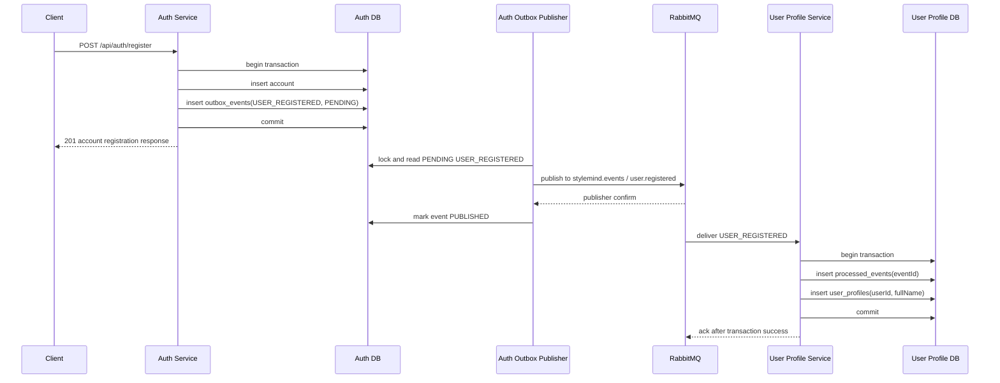

# Auth Flow Contract

## Common Request Flow

1. Client sends request to API Gateway.
2. API Gateway creates or propagates `X-Request-Id`.
3. API Gateway strips untrusted identity headers from the client request.
4. For protected endpoints, API Gateway validates JWT signature and claims.
5. API Gateway writes trusted identity headers for downstream services.
6. Downstream service uses trusted headers or Spring Security principal for ownership checks.
7. Service returns the standard response envelope with the same `requestId`.

## Register

Endpoint: `POST /api/auth/register`

Input includes `email`, `password`, and `fullName`.

Responsibilities:

- Auth validates email uniqueness.
- Auth hashes the password.
- Auth creates an account with status `PENDING` or `ACTIVE`, depending on email verification policy.
- Auth stores the account and a `USER_REGISTERED` outbox event in the same database transaction.
- Auth does not publish RabbitMQ directly inside the registration request transaction.
- Auth outbox publisher later reads `PENDING` events with database locking and publishes `USER_REGISTERED`.
- Auth marks an outbox event `PUBLISHED` only after RabbitMQ publisher confirm succeeds.
- If RabbitMQ is unavailable or publish confirm fails, the event remains `PENDING` and can be retried.
- User Profile Service consumes `USER_REGISTERED` and creates the initial profile record.

Security notes:

- Auth must not persist `fullName` as profile source of truth.
- `USER_REGISTERED` must not include password, password hash, email, phone, address, or refresh token.

Actual sequence:

Retry and DLQ:

- User Profile consumer is idempotent through `processed_events.event_id`.
- Duplicate delivery with the same `eventId` is acknowledged without creating another profile.
- If profile processing fails, the listener throws; Spring AMQP does not ack the message.
- The listener retries according to `user-profile.events.consumer.retry-*`.
- After retry exhaustion, the message is republished to `stylemind.events.dlx` with routing key `user.registered.dlq`.

## Login

Endpoint: `POST /api/auth/login`

Responsibilities:

- Validate email/password.
- Reject `LOCKED` and `DISABLED` accounts.
- Return access token and refresh token for valid accounts.
- Include only auth-owned user data in response: `userId`, `email`, `role`, `accountStatus`.

## Refresh

Endpoint: `POST /api/auth/refresh`

Responsibilities:

- Read refresh token from the HttpOnly cookie first, with request body fallback for non-browser clients.
- Treat refresh tokens as opaque random secrets, not JWTs.
- Hash the presented refresh token and look up only the hash in Auth database.
- Validate that the token exists, is not expired, is not revoked, and belongs to an `ACTIVE` account.
- Rotate on every successful refresh:
  - revoke the old refresh token;
  - create and persist a new refresh token hash;
  - issue a new access token;
  - send the new refresh token to the client via HttpOnly cookie.
- Access token claims remain limited to `sub`, `role`, `type=access`, `jti`, `iat`, and `exp`.

Reuse policy:

- If a previously revoked refresh token is presented again, Auth Service treats it as token reuse.
- Reuse response is `401 INVALID_REFRESH_TOKEN`.
- Reuse mitigation is to revoke all currently active refresh tokens for the same account.
- If the presented token hash is unknown, Auth Service returns `401 INVALID_REFRESH_TOKEN`; no account can be identified safely.

## Logout

Endpoint: `POST /api/auth/logout`

Responsibilities:

- Revoke the presented refresh token.
- Clear the refresh token cookie using the same cookie path/domain config.
- Access tokens remain short-lived and expire naturally.

## Logout All

Endpoint: `POST /api/auth/logout-all`

Responsibilities:

- Revoke all active refresh tokens for the authenticated user.
- Clear the refresh token cookie using the same cookie path/domain config.
- Intended for account security events such as suspicious device activity.

## Change Password

Endpoint: `PUT /api/auth/change-password`

Responsibilities:

- Require authenticated access token.
- Validate current password.
- Store new password hash.
- Increment `token_version`.
- Revoke all refresh tokens after password change.
- Reject a new password that matches the current password.

## Forgot Password

Endpoint: `POST /api/auth/forgot-password`

Responsibilities:

- Accept email.
- Always return a safe success response, even when email does not exist.
- Create a short-lived password reset token if the account exists and policy allows.
- Send reset instructions through notification infrastructure when available.

## Reset Password

Endpoint: `POST /api/auth/reset-password`

Responsibilities:

- Validate password reset token.
- Verify token type is `PASSWORD_RESET`.
- Store new password hash.
- Revoke all refresh tokens for that user.
- Mark reset token as used.

## Verify Email

Endpoint: `POST /api/auth/verify-email`

Responsibilities:

- Validate email verification token.
- Verify token type is `EMAIL_VERIFICATION`.
- Move account from `PENDING` to `ACTIVE`.
- Mark verification token as used.

## Admin Status and Role Changes

Endpoints:

- `PATCH /api/admin/users/{userId}/status`
- `PATCH /api/admin/users/{userId}/role`

Responsibilities:

- Require `ADMIN` role.
- Auth Service owns both operations.
- Changes must be auditable.
- Status changes affect login and token refresh policy.
- Role changes affect new tokens. Existing access tokens expire naturally unless explicit revocation is added.

## User Profile Read/Update

Endpoints:

- `GET /api/users/me`
- `PATCH /api/users/me`

Responsibilities:

- Require authenticated access token.
- User Profile Service reads user id from trusted context.
- User Profile Service owns `fullName`, `phone`, `avatarUrl`, `dateOfBirth`.
- Auth Service is not queried directly for profile fields.

## Address Management

Endpoints:

- `GET /api/users/me/addresses`
- `POST /api/users/me/addresses`
- `PATCH /api/users/me/addresses/{addressId}`
- `DELETE /api/users/me/addresses/{addressId}`
- `PUT /api/users/me/addresses/{addressId}/default`

Responsibilities:

- Require authenticated access token.
- Address operations are scoped to the authenticated user.
- Exactly one default address should exist per user when at least one address is marked default.
- Address ownership checks must query by both `addressId` and authenticated `userId`.
- Default address changes run in one transaction: unset the previous default, then set the requested address as default.
- Delete-default policy: when the default address is deleted and other addresses remain, the oldest remaining address becomes default; if no addresses remain, the user has no default address.
