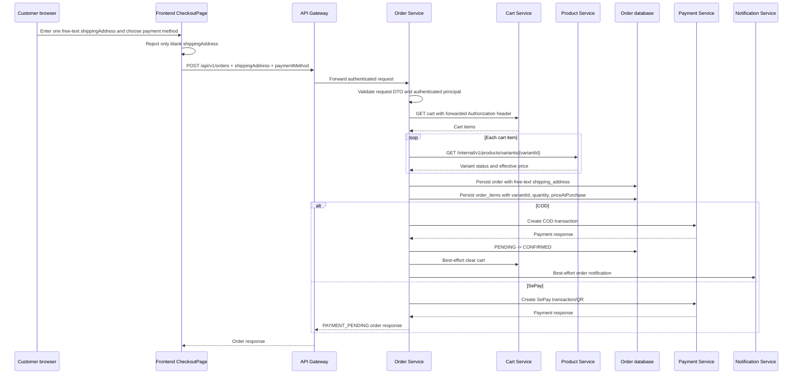

# User Address, Phone, and Order Current-State Audit

**Audit date:** 2026-07-20
**Repository:** StyleMind
**Mode:** Read-only investigation; no implementation or database changes were made.

## 1. Executive Summary

The current model stores phone information on individual delivery addresses, not on the authentication user or customer style profile. A delivery address contains `recipientName`, `phoneNumber`, `addressLine`, `city`, and `isDefault`. The address API requires the first four values to be nonblank, but phone validation is limited to a maximum length of 20 characters; there is no Vietnamese phone-format validator or `libphonenumber` integration.

The frontend has two separate flows:

- Profile management can create, update, list, delete, and mark delivery addresses as default.
- Checkout uses a textarea for one free-text `shippingAddress` value. It does not load profile addresses, submit `addressId`, submit phone information, or save checkout input back to the User Service.

Order creation therefore does not validate or persist a phone number. A user can currently place an order without a user/profile phone because the create-order contract has no phone field. A nonblank free-text shipping address is required by both the checkout page and Order Service, but it is not validated as a structured Vietnamese address.

Orders persist a single `orders.shipping_address` text snapshot. This makes historical orders independent of later profile-address edits or deletions, but the snapshot contains no recipient phone, recipient name, administrative codes, province/district/ward fields, or shipping note. `order_items` stores the purchased variant ID, quantity, and price snapshot, but not address-related data.

The highest-risk gaps are:

1. Checkout is not connected to the saved address book.
2. Order creation does not require or validate a phone number.
3. Vietnamese administrative address attributes are not represented in the current model.
4. The order snapshot is only a free-text address and does not include a phone snapshot.
5. Checkout-time inventory is not revalidated by Order Service; stock validation occurs in Cart Service when an item is added.

## 2. Audit Scope and Constraints

This audit covered the current source, SQL/init definitions, JPA mappings, frontend API/form code, Docker configuration, and read-only runtime PostgreSQL metadata and aggregate counts.

No source code, frontend code, tests, configuration, SQL, database records, Docker volumes, or existing documentation were modified. No migration was created or applied. Personal values were not included; runtime results are limited to schema metadata and aggregate counts.

## 3. Repository and Runtime Environment

### Repository state

- Current branch: `VoKhai`
- HEAD at audit start: `b6355cdc`
- Pre-existing uncommitted changes: none (`git status --short` was empty)
- Recent related work includes checkout/idempotency, cart/checkout flow, service URL configuration, and the dedicated admin order-detail feature.

### Relevant components

| Component | Responsibility | Relevant files |
|---|---|---|
| Auth Service | Authentication user record and account status | `BE/auth-service/src/main/java/com/stylemind/auth/entity/User.java` |
| User Service | Style profile and delivery-address CRUD | `BE/user-service/src/main/java/com/stylemind/user/entity/DeliveryAddress.java`, `UserProfileController.java`, `UserProfileService.java` |
| Cart Service | Cart ownership, item quantity, variant availability checks | `BE/cart-service/src/main/java/com/stylemind/cart/service/CartService.java` |
| Order Service | Checkout orchestration, order persistence, payment initialization | `BE/order-service/src/main/java/com/stylemind/order/controller/OrderController.java`, `OrderService.java` |
| Payment Service | COD/SePay transaction initialization and payment state | Called by `OrderService` through `PaymentClient` |
| API Gateway | Public `/api/v1/**` routing and authentication filters | `BE/api-gateway` |
| Frontend profile | Address-book UI and address API calls | `FE/src/pages/auth/StyleProfilePage.jsx`, `FE/src/features/profile/profile.api.js` |
| Frontend checkout | Free-text shipping input and order submission | `FE/src/pages/customer/CheckoutPage.jsx`, `FE/src/features/payment/payment.store.js` |

### Runtime availability

The Docker Compose stack was already running. Read-only access succeeded for `postgres-user` and `postgres-order`. No services were restarted or recreated.

Runtime aggregate results:

| Database | Metric | Count |
|---|---|---:|
| `user_db` | customer style profiles | 7 |
| `user_db` | delivery addresses | 8 |
| `user_db` | addresses with null phone | 0 |
| `user_db` | addresses with blank phone | 0 |
| `user_db` | addresses with null/blank address line | 0 |
| `user_db` | addresses with null/blank city | 0 |
| `user_db` | users with the largest observed address count | 2 |
| `order_db` | orders | 22 |
| `order_db` | orders with null shipping address | 0 |
| `order_db` | orders with blank shipping address | 0 |
| `order_db` | order items | 26 |
| `order_db` | orders represented by at least one order item | 22 |

These counts describe the current local database only and do not prove that all historical or future data satisfies business requirements.

## 4. Database Schema Inventory

### User database

The current User Service database contains `customer_style_profiles` and `delivery_addresses`; the authentication `users` table belongs to the separate Auth database.

| Table | Relevant columns | Constraints/indexes | Owner |
|---|---|---|---|
| `customer_style_profiles` | `user_id VARCHAR(50)`, optional style fields, `created_at`, `updated_at` | Primary key on `user_id`; timestamps are non-null at runtime | User Service |
| `delivery_addresses` | `id VARCHAR(50)`, `user_id VARCHAR(50)`, `recipient_name VARCHAR(100)`, `phone_number VARCHAR(20)`, `address_line TEXT`, `city VARCHAR(100)`, `is_default BOOLEAN`, timestamps | Primary key on `id`; required columns are non-null; index on `user_id`; partial index on `(user_id, is_default)` where default is true | User Service |

There are no columns for province code/name, district code/name, ward code/name, commune code/name, postal code, shipping note, address status, validation status, or administrative-data version. There is no cross-database foreign key from `delivery_addresses.user_id` to Auth Service because the services own separate databases.

The SQL init definition in `BE/init-scripts/02-user-db.sql`, the User Service Flyway baseline in `BE/user-service/src/main/resources/db/migration/V1__baseline_user_schema.sql`, the `DeliveryAddress` entity, and the runtime schema agree for the audited address columns and constraints. User Service has Flyway enabled and SQL init disabled in `application.yml`; the runtime database exposes `flyway_schema_history`.

### Order database

| Table | Relevant columns | Constraints/indexes | Owner |
|---|---|---|---|
| `orders` | `id`, `user_id`, `total_amount DECIMAL(12,2)`, `order_status`, `shipping_address TEXT`, timestamps | Primary key on `id`; non-null `user_id`, amount, status, shipping address; status check constraint; indexes on user and status/created time | Order Service |
| `order_items` | `id`, `order_id`, `variant_id`, `quantity`, `price_at_purchase DECIMAL(12,2)`, AI/source fields, timestamps | Primary key; FK to `orders` with cascade delete; quantity check; indexes on order and variant | Order Service |
| `order_status_audit_log` | order ID, actor ID, from/to status, timestamps | Primary key; FK to orders; status checks; index on order ID | Order Service |
| `checkout_idempotency` | user ID, idempotency key, order ID, status, error, timestamps | Unique `(user_id, idempotency_key)`; FK to order; index on order ID | Order Service |

There is no `order_shipping_addresses` table, embedded address object, JSON snapshot, `shipping_phone`, `recipient_name`, `address_id`, province/district/ward field, or shipping-note field in the current order schema.

The SQL init definition in `BE/init-scripts/06-order-db.sql`, `Order`, `OrderItem`, and runtime schema agree for the audited order fields. Order Service uses `ddl-auto: update` and SQL init mode `never` in its current `application.yml`; the runtime schema was inspected without applying any update.

### Database–entity–DTO–frontend comparison

| Table/field | SQL definition | Entity mapping | Runtime schema | Result |
|---|---|---|---|---|
| `delivery_addresses.phone_number` | `VARCHAR(20) NOT NULL` | `DeliveryAddress.phoneNumber`, length 20, non-null | Present, `character varying(20)`, non-null | MATCH |
| `delivery_addresses.city` | `VARCHAR(100) NOT NULL` | `DeliveryAddress.city`, length 100, non-null | Present, `character varying(100)`, non-null | MATCH |
| `delivery_addresses.is_default` | `BOOLEAN NOT NULL DEFAULT FALSE` | `Boolean isDefault`, non-null, default false | Present, non-null, default false | MATCH |
| `orders.shipping_address` | `TEXT NOT NULL` | `Order.shippingAddress`, TEXT, non-null | Present, `text`, non-null | MATCH |
| `order_items.price_at_purchase` | `DECIMAL(12,2) NOT NULL` | `OrderItem.priceAtPurchase`, precision 12/scale 2, non-null | Present with numeric precision 12/scale 2 | MATCH |
| Structured Vietnamese address attributes | Not defined | Not mapped | Not present | MISSING CAPABILITY |
| Order phone snapshot | Not defined | Not mapped | Not present | MISSING CAPABILITY |

## 5. User Phone Data Model

### Answers to the audit questions

1. The Auth `User` entity and customer style profile do not have a phone field.
2. `DeliveryAddress.phoneNumber` is not nullable in the entity, DTO validation, SQL, or runtime schema.
3. Phone is stored once per shipping address, so one user may have different recipient phones on different addresses.
4. Accepted backend format is any nonblank value up to 20 characters. It is not restricted to a Vietnamese format.
5. No phone regex or custom phone validator was found.
6. `libphonenumber` and `PhoneNumberUtil` are not present in the inspected User Service/frontend sources.
7. The frontend trims the phone string before sending it; there is no phone normalization beyond that.
8. Order creation does not revalidate phone because the create-order request has no phone field.
9. An order can be created without a user/profile phone.
10. The Order entity and response do not store a phone snapshot.

### Phone field matrix

| Layer | Class/table/component | Field | Type | Required | Validation/behavior |
|---|---|---|---|---|---|
| Auth | `User` / `users` | None | N/A | N/A | No profile phone field |
| User profile | `CustomerStyleProfile` / `customer_style_profiles` | None | N/A | N/A | Style data only |
| User address entity | `DeliveryAddress` / `delivery_addresses` | `phoneNumber` / `phone_number` | String / `VARCHAR(20)` | Yes | JPA non-null; DB non-null |
| Address request | `DeliveryAddressRequest` | `phoneNumber` | String | Yes | `@NotBlank`, `@Size(max=20)` |
| Address response | `DeliveryAddressResponse` | `phoneNumber` | String | Returned when present | No additional validation |
| Profile UI | `StyleProfilePage.jsx` | `addressForm.phoneNumber` | React state string | Required by backend submission | Trimmed; input placeholder suggests a Vietnamese number but no format validator |
| Checkout request | `CreateOrderRequest` | None | N/A | N/A | No phone field |
| Order storage | `Order` / `orders` | None | N/A | N/A | No phone snapshot |

## 6. User Address Data Model

### Current address attributes

| Proposed concept | Current field | Current layer | Stored? | Required? | Notes |
|---|---|---|---|---|---|
| Address ID | `id` | User DTO/entity/table | Yes | Yes | Primary key, generated by User Service |
| User ID | `userId` / `user_id` | User DTO/entity/table | Yes | Yes | Ownership field; no cross-database FK |
| Recipient name | `recipientName` / `recipient_name` | User DTO/entity/table/UI | Yes | Yes | Max 100 characters |
| Recipient phone | `phoneNumber` / `phone_number` | User DTO/entity/table/UI | Yes | Yes | Max 20 characters; no Vietnamese format check |
| Address line | `addressLine` / `address_line` | User DTO/entity/table/UI | Yes | Yes | Free text |
| Province/city | `city` | User DTO/entity/table/UI | Yes | Yes | A single free-text city field; no code |
| District | None | None | No | N/A | Not represented |
| Ward/commune | None | None | No | N/A | Not represented |
| House number/street | Part of `addressLine` | User UI/database | Derived/free text | Not separately required | No separate fields |
| Postal code | None | None | No | N/A | Not represented |
| Shipping note | None | None | No | N/A | Not represented |
| Default address | `isDefault` / `is_default` | User DTO/entity/table/UI | Yes | Boolean required; false default | Service clears previous defaults before setting one |
| Address status | None | None | No | N/A | No active/inactive flag |
| Validation status | None | None | No | N/A | No persisted validation result |
| Administrative-data version | None | None | No | N/A | Not represented |
| Created/updated timestamps | `createdAt`, `updatedAt` | Base entity/table/response | Yes | Yes in runtime schema | Returned by address response |

### Address behavior

- Multiple addresses per user are supported through `findByUserId`.
- A default address is supported through `isDefault`; the repository has a filtered default index and the service clears existing defaults before setting a new one.
- Users can add, edit, delete, list, and mark an address as default from the profile page.
- Checkout does not list or select saved addresses.
- Checkout does not save its free-text address to the User Service.
- Checkout does not send `addressId`.
- The User Service validates address ownership for address update, delete, and the internal address lookup endpoint.
- Province/ward existence and parent-child relationships are not checked because those attributes are not present.
- District is not a required or optional current field; it is only text that a user may include inside `addressLine`.
- Addresses are hard-deleted with `addressRepository.delete`; there is no soft-delete or inactive state.
- An inactive address cannot be used because no inactive-address concept exists, but checkout also does not reference any address record.

## 7. Frontend Profile and Checkout Flow

### Profile/address flow

`FE/src/pages/auth/StyleProfilePage.jsx` has an address form with:

- `recipientName`
- `phoneNumber`
- `addressLine`
- `city`
- `isDefault`

`buildAddressPayload` trims the four strings and converts `isDefault` to a boolean. `handleAddressSubmit` calls the existing profile API and reloads the address list. The UI does not validate phone format, province/ward relationships, or structured administrative codes.

The corresponding frontend API calls in `FE/src/features/profile/profile.api.js` are:

- `GET /api/v1/users/addresses`
- `POST /api/v1/users/addresses`
- `PUT /api/v1/users/addresses/{addressId}`
- `DELETE /api/v1/users/addresses/{addressId}`
- `GET/PUT /api/v1/users/style-profile` for style profile data only

All are Gateway-facing paths. The frontend does not call User Service internal paths.

### Checkout flow

`FE/src/pages/customer/CheckoutPage.jsx` maintains only `shippingAddress` as a string. Before submission it checks `shippingAddress.trim()` and shows a Vietnamese error when empty. The form is a textarea whose placeholder asks for a complete address containing house number, street, district, and city, but those values remain one free-text string.

`FE/src/features/payment/payment.store.js` calls `createOrder` with:

```json
{
  "shippingAddress": "<ADDRESS_REDACTED>",
  "paymentMethod": "cod"
}
```

or the same shape with `"sepay"`. It also sends an `Idempotency-Key` header for the checkout attempt. There is no phone, `addressId`, recipient name, province, district, ward, or shipping note in the request.

`FE/src/features/orders/order.api.js` posts this payload to `/api/v1/orders`; the browser does not call Order Service directly.

## 8. User Service API Flow

| Endpoint | Method | Auth | Request | Response | Validation/ownership |
|---|---|---|---|---|---|
| `/api/v1/users/style-profile` | GET | Authenticated user | None | Style profile | User ID comes from authenticated principal |
| `/api/v1/users/style-profile` | PUT | Authenticated user | Style profile fields | Style profile | Bean validation for style fields |
| `/api/v1/users/addresses` | GET | Authenticated user | None | Address list | User ID comes from authenticated principal |
| `/api/v1/users/addresses` | POST | Authenticated user | `recipientName`, `phoneNumber`, `addressLine`, `city`, `isDefault` | Created address | `@Valid`; required strings; phone max length |
| `/api/v1/users/addresses/{addressId}` | PUT | Authenticated user | Same address body | Updated address | Service checks address belongs to principal user |
| `/api/v1/users/addresses/{addressId}` | DELETE | Authenticated user | None | Empty success response | Service checks ownership; hard delete |
| `/internal/v1/users/{userId}/addresses/{addressId}` | Internal token | None from browser | Path IDs | Address response | Service checks address belongs to specified user |

The inspected internal User Service controller exposes only the address lookup shown above. Order Service does not use it during current checkout. Its `UserClient` is used for user email enrichment/notifications, not address retrieval.

## 9. Current Order Creation Flow



The User Service address book is not a participant in this current order-creation sequence. Payment initialization happens only after the cart and variant/price checks succeed.

## 10. Order Validation Matrix

| Validation | Frontend | Gateway | Order Service | User Service | Database | Result |
|---|---|---|---|---|---|---|
| Authenticated user required | Uses authenticated session | JWT/filter boundary | `@AuthenticationPrincipal UserPrincipal` | N/A | N/A | ENFORCED |
| Cart required | Uses cart UI | N/A | Cart lookup | N/A | Cart schema | ENFORCED |
| Cart not empty | No explicit order check | N/A | Rejects empty cart | N/A | N/A | ENFORCED |
| Variant exists | N/A | N/A | Product snapshot lookup | N/A | Product DB | ENFORCED |
| Variant active | N/A | N/A | Rejects non-active snapshot | N/A | Product DB status | ENFORCED |
| Quantity positive | N/A | N/A | Rejects non-positive cart quantity | Cart also validates | DB check on order item | ENFORCED |
| Sufficient inventory | Cart add flow checks active/stock snapshot | N/A | Does not reserve/recheck stock during order creation | N/A | Product stock field | PARTIALLY ENFORCED |
| Payment method valid | Selection is limited in UI | N/A | `@NotBlank` and `@Pattern` for `cod|sepay` | N/A | N/A | ENFORCED |
| Phone present | No checkout phone field | N/A | No phone field | Required only for address CRUD | Address column required | PARTIALLY ENFORCED |
| Phone valid Vietnamese format | No | N/A | No | No regex/custom validator | No check constraint | NOT ENFORCED |
| Shipping address present | Rejects blank textarea | N/A | `@NotBlank shippingAddress` | Not involved | `shipping_address NOT NULL` | ENFORCED for nonblank text |
| Structured address valid | No structured fields | N/A | No structured fields | No structured fields | No structured columns | NOT ENFORCED |
| Address belongs to user | No `addressId` | N/A | No lookup | Address CRUD/internal lookup checks ownership | No cross-DB FK | NOT APPLICABLE TO CHECKOUT |
| Province exists | No province field | N/A | No check | No check | No field | NOT ENFORCED |
| Ward exists | No ward field | N/A | No check | No check | No field | NOT ENFORCED |
| Ward belongs to province | No relationship available | N/A | No check | No check | No field | NOT ENFORCED |
| District required | No district field | N/A | No check | No check | No field | NOT ENFORCED |
| Recipient name required for order | No checkout field | N/A | No field | Required for address CRUD only | No order field | NOT ENFORCED |
| Address line present | Part of free-text address | N/A | Only whole string `@NotBlank` | Required for address CRUD | Text snapshot non-null | PARTIALLY ENFORCED |

### Direct answers for current behavior

| Scenario | Current result |
|---|---|
| User phone is null | Order can still be created because checkout does not submit phone. Address CRUD itself rejects a null phone. |
| User phone is empty | Order can still be created if a separate nonblank free-text shipping address is supplied; checkout has no phone check. Address CRUD rejects blank phone. |
| User phone has invalid Vietnamese format | Order can still be created; no Vietnamese phone-format rule exists. |
| Address is null/omitted | Frontend blocks its own blank state; Order Service `@NotBlank` rejects the request if it reaches the controller. |
| Address is an empty/blank string | Frontend blocks it; Order Service rejects it with validation. |
| Address belongs to another user | There is no checkout `addressId`, so this case is not evaluated. The address-book endpoints do perform ownership checks. |
| Province is invalid | Accepted as part of arbitrary free text because province is not a field. |
| Ward is invalid | Accepted as part of arbitrary free text because ward is not a field. |
| Ward does not belong to province | Not evaluable; no administrative relationship is stored or checked. |
| Only free-text address is supplied | Accepted when nonblank; this is the current checkout contract. |

## 11. Shipping Snapshot Behavior

Order creation maps `CreateOrderRequest.shippingAddress` directly to `Order.shippingAddress`. The order response returns the same free-text field. There is no address ID relationship or separate shipping snapshot object.

| Source field | Order snapshot field | Mapper | Nullable | Notes |
|---|---|---|---|---|
| `CreateOrderRequest.shippingAddress` | `orders.shipping_address` | `OrderService.createOrder` | No at request/entity/DB layers | Free-text value copied as submitted |
| Profile `recipientName` | None | None | N/A | Not submitted by checkout |
| Profile `phoneNumber` | None | None | N/A | Not submitted by checkout |
| Profile `addressLine` | None directly | None | N/A | Checkout does not select an address |
| Profile `city` | None directly | None | N/A | Checkout uses its own free text |
| Profile administrative codes | None | None | N/A | Not represented |

Consequences:

1. Changing a user profile address does not alter an existing order's free-text snapshot.
2. Deleting a user address does not alter an existing order's free-text snapshot.
3. Admin/customer order responses can display the stored free-text address for old orders.
4. Recipient phone is not available from the order snapshot.
5. Administrative codes and names are not available from the order snapshot.
6. Snapshot creation is covered indirectly by order-service tests that set `shippingAddress`, but there is no test proving a structured address or phone snapshot because those fields do not exist.

## 12. Runtime Data Quality Summary

Runtime inspection was available for `user_db` and `order_db` and used only aggregate queries.

- `user_db`: 7 style profiles and 8 delivery addresses.
- All 8 runtime delivery-address rows had non-null, nonblank phone numbers.
- All 8 runtime delivery-address rows had non-null, nonblank address lines and cities.
- 6 runtime address rows were marked default. The schema has no unique constraint enforcing one default per user; the service clears existing defaults before setting a new one.
- `order_db`: 22 orders and 26 order items.
- All 22 runtime orders had non-null, nonblank `shipping_address` values.
- All 22 runtime orders had at least one order item.
- Runtime counts do not show whether phone values are valid Vietnamese numbers or whether free-text addresses are administratively valid.

No real names, phone numbers, addresses, order IDs, or payment IDs were included in this report.

## 13. Database–Entity–DTO–Frontend Mismatches

### Confirmed gaps

1. **Profile address versus checkout contract:** User Service exposes structured address-book fields, but CheckoutPage never reads or selects them.
2. **Phone scope:** The only phone field is `DeliveryAddress.phoneNumber`; the order request and order entity have no phone field.
3. **Address shape:** Profile uses `addressLine` plus `city`; checkout uses one free-text `shippingAddress`. They are not adapted into one shared contract.
4. **Administrative hierarchy:** Province, district, ward, commune, and their codes/relationships are absent from SQL, entities, DTOs, frontend types/forms, and checkout requests.
5. **Order snapshot:** The order snapshot contains only free text, not recipient or structured address information.
6. **Checkout ownership validation:** Since checkout has no `addressId`, Order Service cannot verify that a selected saved address belongs to the authenticated user.
7. **Order Service User client:** The current internal client looks up user email for notification enrichment; it does not retrieve delivery addresses.

### Confirmed matches

1. Delivery-address entity, request validation, init/baseline SQL, and runtime schema agree on the current five address fields and timestamps.
2. Order entity, order request, order response, init SQL, and runtime schema agree on the single required `shipping_address` text field.
3. Order item price uses `price_at_purchase`, and the checkout flow does not replace it with a user-profile value.

## 14. Current API Contracts

### Address creation/update through the Gateway

```http
POST /api/v1/users/addresses
Content-Type: application/json
Authorization: Bearer <ACCESS_TOKEN>
```

```json
{
  "recipientName": "<REDACTED>",
  "phoneNumber": "<PHONE_REDACTED>",
  "addressLine": "<ADDRESS_REDACTED>",
  "city": "<CITY_REDACTED>",
  "isDefault": true
}
```

### Current checkout request through the Gateway

```http
POST /api/v1/orders
Content-Type: application/json
Idempotency-Key: <CHECKOUT_ATTEMPT_KEY>
Authorization: Bearer <ACCESS_TOKEN>
```

```json
{
  "shippingAddress": "<ADDRESS_REDACTED>",
  "paymentMethod": "cod"
}
```

The current `OrderResponse` includes `shippingAddress`, order status, payment fields when available, items, status history, and timestamps. It does not include phone, address ID, recipient name, or administrative address fields.

## 15. Gap Analysis Against Target Requirements

| Requirement | Current state | Existing support | Missing work | Risk |
|---|---|---|---|---|
| Validate Vietnamese administrative addresses | Free-text address only; no codes or hierarchy | Required nonblank address line/city on address CRUD | Data model, authoritative administrative data, relationship validation, API/UI rules | BLOCKER |
| Validate Vietnamese phone numbers | Nonblank/max 20 only on saved addresses | Bean validation and DB non-null | Format/normalization policy and checkout enforcement | HIGH |
| Save valid addresses in user information | Address CRUD exists | User Service CRUD, ownership checks, default flag | Connect checkout to address selection or define save-on-checkout behavior | HIGH |
| Prevent order without valid phone | Checkout has no phone field | None at Order Service | Contract, frontend validation, backend validation, error behavior | BLOCKER |
| Prevent order without valid shipping address | Nonblank free text required | Frontend and Order Service `@NotBlank`; DB non-null | Structured validation and ownership semantics | HIGH |
| Store shipping-address snapshot in Order | Stores only free-text `shipping_address` | Stable text survives profile changes | Decide snapshot shape and add recipient/phone/administrative data if required | HIGH |

Historical data would need a separate policy if new structured snapshot fields become mandatory: existing orders currently have only free-text address data and cannot be reliably backfilled into authoritative administrative codes without external matching.

## 16. Recommended Implementation Boundaries

No code is proposed or applied in this audit. Future work should be separated as follows:

### User Service

- Decide whether the canonical address model needs recipient phone, administrative codes/names, postal code, notes, and status/version fields.
- Define normalization and Vietnamese phone/address validation ownership.
- Preserve address ownership checks and default-address behavior.

### Order Service

- Define whether checkout accepts `addressId`, a complete address object, or both.
- Validate ownership through an internal User Service lookup if `addressId` is accepted.
- Create an immutable shipping snapshot at order creation, including only approved fields.
- Define behavior when a saved address changes or is deleted after ordering.

### Frontend

- Connect checkout to the address-book API or add an approved checkout-address form.
- Make phone and address validation consistent with backend rules.
- Keep all calls Gateway-facing; do not call User Service internal endpoints from the browser.

### Database

- Add only fields supported by an approved domain contract and migration strategy.
- Keep historical order snapshots immutable.
- Decide whether default-address uniqueness should be database-enforced in addition to service logic.

### Tests

- Add User Service validation/ownership tests.
- Add checkout contract tests for missing/invalid phone and address.
- Add Order Service snapshot tests covering recipient phone and structured fields if introduced.
- Add integration tests proving an address from another user cannot be selected.

### Data migration

- Treat existing free-text order addresses as historical snapshots.
- Do not infer or silently rewrite historical administrative codes or phone values.
- Define an explicit backfill or “legacy free-text” state only if the product requires it.

## 17. Open Questions

1. Should a phone number be a user-level contact attribute, an address-level recipient attribute, or both?
2. Should checkout select a saved address by `addressId`, accept a new complete address, or support both paths?
3. Which Vietnamese administrative data source and version should be authoritative?
4. Should the order snapshot store administrative codes, display names, or both?
5. Should a saved address be immutable after it is used, or should historical orders simply retain a copied snapshot?
6. Is the current Cart Service stock check sufficient for the checkout consistency requirement, or is an order-time reservation required?

## 18. Evidence and Commands

### Files inspected

- `BE/auth-service/src/main/java/com/stylemind/auth/entity/User.java`
- `BE/user-service/src/main/java/com/stylemind/user/entity/DeliveryAddress.java`
- `BE/user-service/src/main/java/com/stylemind/user/entity/CustomerStyleProfile.java`
- `BE/user-service/src/main/java/com/stylemind/user/dto/DeliveryAddressRequest.java`
- `BE/user-service/src/main/java/com/stylemind/user/dto/DeliveryAddressResponse.java`
- `BE/user-service/src/main/java/com/stylemind/user/service/UserProfileService.java`
- `BE/user-service/src/main/java/com/stylemind/user/controller/UserProfileController.java`
- `BE/user-service/src/main/java/com/stylemind/user/controller/InternalUserController.java`
- `BE/user-service/src/main/java/com/stylemind/user/repository/DeliveryAddressRepository.java`
- `BE/user-service/src/main/resources/db/migration/V1__baseline_user_schema.sql`
- `BE/user-service/src/main/resources/db/migration/V2__profile_boundary.sql`
- `BE/init-scripts/02-user-db.sql`
- `BE/order-service/src/main/java/com/stylemind/order/dto/CreateOrderRequest.java`
- `BE/order-service/src/main/java/com/stylemind/order/dto/OrderResponse.java`
- `BE/order-service/src/main/java/com/stylemind/order/entity/Order.java`
- `BE/order-service/src/main/java/com/stylemind/order/entity/OrderItem.java`
- `BE/order-service/src/main/java/com/stylemind/order/controller/OrderController.java`
- `BE/order-service/src/main/java/com/stylemind/order/service/OrderService.java`
- `BE/order-service/src/main/java/com/stylemind/order/feign/UserClient.java`
- `BE/order-service/src/main/resources/application.yml`
- `BE/init-scripts/06-order-db.sql`
- `BE/cart-service/src/main/java/com/stylemind/cart/service/CartService.java`
- `FE/src/pages/auth/StyleProfilePage.jsx`
- `FE/src/pages/customer/CheckoutPage.jsx`
- `FE/src/features/profile/profile.api.js`
- `FE/src/features/payment/payment.store.js`
- `FE/src/features/orders/order.api.js`
- `FE/src/services/endpoints.js`
- relevant sections of `BE/docker-compose.yml`

### Read-only repository commands

- `git status --short`
- `git branch --show-current`
- `git log --oneline --decorate -n 30`
- `git diff`
- `rg` searches for phone, address, checkout, order, and validation references
- `nl -ba` source and SQL inspection

### Read-only runtime commands

- `docker compose ps --format ...`
- `docker exec postgres-user psql ... -c` for information-schema tables/columns, constraints, indexes, and aggregate counts
- `docker exec postgres-order psql ... -c` for information-schema tables/columns, constraints, indexes, and aggregate counts

No tests or builds were required for this read-only audit. No SQL write statements, migrations, container restarts, volume operations, or record-level queries were executed.
