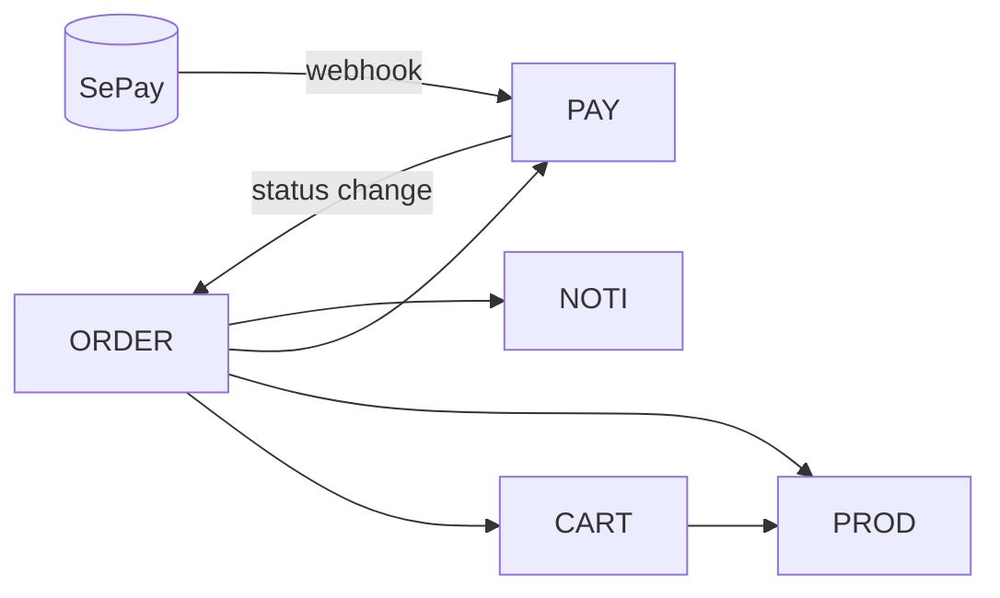

# Services — Catalog

Mở file service tương ứng khi bạn đang code service đó.

| Service | Port | DB | File |
|---|---|---|---|
| api-gateway | 3001 | — | `api-gateway.md` |
| auth-service | 8081 | auth_db | `auth-service.md` |
| user-service | 8082 | user_db | `user-service.md` |
| product-service | 8083 | product_db | `product-service.md` |
| cart-service | 8086 | cart_db | `cart-service.md` |
| order-service | 8087 | order_db | `order-service.md` |
| payment-service | 8088 | payment_db | `payment-service.md` |
| notification-service | 8089 | notification_db | `notification-service.md` |
| ai-agent-service | 8085 | ai_db | `ai-agent-service.md` |

## Bản đồ phụ thuộc (ai gọi ai)

Tất cả gọi chéo dùng `/internal/v1/**` + `X-Internal-Token`.
